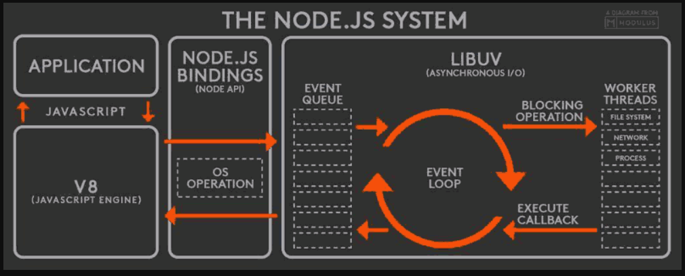

# Node.js and Express.js Interview Preparation  
---

# 📚 Table of Contents

| No. | Question | Importance (Interview Perspective) |
|---|---|---|
| 1 | [What is Node.js? Why is it used?](#1-what-is-nodejs-why-is-it-used-) | ⭐⭐⭐⭐⭐ |
| 2 | [Explain the event-driven architecture in Node.js](#2-explain-the-event-driven-architecture-in-nodejs-) | ⭐⭐⭐⭐⭐ |
| 3 | [What is the event loop and how does it work?](#3-what-is-the-event-loop-and-how-does-it-work-) | ⭐⭐⭐⭐⭐ |
| 4 | [What are microtasks and macrotasks in Node.js?](#4-what-are-microtasks-and-macrotasks-in-nodejs-) | ⭐⭐⭐⭐⭐ |
| 5 | [Difference between process.nextTick(), setImmediate(), and setTimeout()](#5-difference-between-processnexttick-setimmediate-and-settimeout-) | ⭐⭐⭐⭐⭐ |
| 6 | [How does Node.js handle asynchronous operations?](#6-how-does-nodejs-handle-asynchronous-operations-) | ⭐⭐⭐⭐⭐ |
| 7 | [Difference between blocking and non-blocking code](#7-difference-between-blocking-and-non-blocking-code-) | ⭐⭐⭐⭐⭐ |
| 8 | [What are streams in Node.js? Types?](#8-what-are-streams-in-nodejs-types-) | ⭐⭐⭐⭐⭐ |
| 9 | [How does Node.js handle child processes?](#9-how-does-nodejs-handle-child-processes-) | ⭐⭐⭐⭐ |
| 10 | [What is the purpose of the cluster module?](#10-what-is-the-purpose-of-the-cluster-module-) | ⭐⭐⭐⭐ |
| 11 | [CommonJS vs ES Modules](#11-difference-between-commonjs-and-es-modules-) | ⭐⭐⭐⭐⭐ |
| 12 | [Create and export custom modules](#12-how-do-you-create-and-export-a-custom-module-) | ⭐⭐⭐⭐ |
| 13 | [What is package.json?](#13-what-is-packagejson-and-important-fields-) | ⭐⭐⭐⭐⭐ |
| 14 | [dependencies vs devDependencies](#14-difference-between-dependencies-and-devdependencies-) | ⭐⭐⭐⭐⭐ |
| 15 | [Environment variables](#15-how-do-you-handle-environment-variables-in-nodejs-) | ⭐⭐⭐⭐⭐ |
| 16 | [Callbacks vs Promises vs Async/Await](#16-difference-between-callbacks-promises-and-asyncawait-) | ⭐⭐⭐⭐⭐ |
| 17 | [Error handling in async functions](#17-how-do-you-handle-errors-in-async-functions-) | ⭐⭐⭐⭐⭐ |
| 18 | [Promise.all vs Promise.race](#18-difference-between-promiseall-and-promiserace-) | ⭐⭐⭐⭐⭐ |
| 19 | [Forgetting await](#19-what-happens-if-you-forget-await-in-an-async-function-) | ⭐⭐⭐⭐ |
| 20 | [Explain libuv](#20-explain-libuv-in-nodejs-) | ⭐⭐⭐⭐ |
| 21 | [What is semantic versioning (semver)?](#21-what-is-semantic-versioning-semver-) | ⭐⭐ |
| 22 | [Difference between npm install and npm ci](#22-difference-between-npm-install-and-npm-ci-) | ⭐⭐⭐⭐ |
| 23 | [What is package-lock.json?](#23-what-is-package-lockjson-) | ⭐⭐⭐⭐ |
| 24 | [How do you handle dependency vulnerabilities?](#24-how-do-you-handle-dependency-vulnerabilities-) | ⭐⭐⭐⭐ |
| 25 | [What are peer dependencies?](#25-what-are-peer-dependencies-) | ⭐⭐ |
| 26 | [How does Promise chaining work?](#26-how-does-promise-chaining-work-) | ⭐⭐⭐⭐ |
| 27 | [What is util.promisify()?](#27-what-is-utilpromisify-) | ⭐⭐ |
| 28 | [How do you retry failed async operations?](#28-how-do-you-retry-failed-async-operations-) | ⭐⭐⭐⭐ |
| 29 | [How do you implement timeout for promises?](#29-how-do-you-implement-timeout-for-promises-) | ⭐⭐⭐⭐ |
| 30 | [What is backpressure in streams?](#30-what-is-backpressure-in-streams-) | ⭐⭐⭐⭐ |
| 31 | [What are middleware functions in Express?](#31-what-are-middleware-functions-in-express-) | ⭐⭐⭐⭐⭐ |
| 32 | [Difference between app.use() and app.get()](#32-difference-between-appuse-and-appget-) | ⭐⭐⭐⭐⭐ |
| 33 | [How do you create a RESTful API with Node.js?](#33-how-do-you-create-a-restful-api-with-nodejs-) | ⭐⭐⭐⭐⭐ |
| 34 | [How do you handle global errors in Express?](#34-how-do-you-handle-global-errors-in-express-) | ⭐⭐⭐⭐⭐ |
| 35 | [How do you handle 404 routes in Express?](#35-how-do-you-handle-404-routes-in-express-) | ⭐⭐⭐⭐ |
| 36 | [Route params vs query params](#36-route-params-vs-query-params-) | ⭐⭐⭐⭐⭐ |
| 37 | [How do you validate request data?](#37-how-do-you-validate-request-data-) | ⭐⭐⭐⭐⭐ |
| 38 | [How do you secure Express APIs?](#38-how-do-you-secure-express-apis-) | ⭐⭐⭐⭐⭐ |
| 39 | [How do you upload files in Express?](#39-how-do-you-upload-files-in-express-) | ⭐⭐⭐⭐ |
| 40 | [How do you handle request body limits?](#40-how-do-you-handle-request-body-limits-) | ⭐⭐⭐⭐ |
| 41 | [How do you create modular routes in Express?](#41-how-do-you-create-modular-routes-in-express-) | ⭐⭐⭐⭐⭐ |
| 42 | [What is Express Router?](#42-what-is-express-router-) | ⭐⭐⭐⭐⭐ |
| 43 | [How do you chain routes in Express?](#43-how-do-you-chain-routes-in-express-) | ⭐⭐ |
| 44 | [How do you redirect requests in Express?](#44-how-do-you-redirect-requests-in-express-) | ⭐⭐⭐ |
| 45 | [How do you handle query pagination in APIs?](#45-how-do-you-handle-query-pagination-in-apis-) | ⭐⭐⭐⭐⭐ |
| 46 | [How do you implement API versioning in Express?](#46-how-do-you-implement-api-versioning-in-express-) | ⭐⭐⭐⭐ |
| 47 | [How do you handle dynamic routes in Express?](#47-how-do-you-handle-dynamic-routes-in-express-) | ⭐⭐⭐⭐ |
| 48 | [How do you create reusable route middlewares?](#48-how-do-you-create-reusable-route-middlewares-) | ⭐⭐⭐⭐⭐ |
| 49 | [How do you implement authentication in Express?](#49-how-do-you-implement-authentication-in-express-) | ⭐⭐⭐⭐⭐ |
| 50 | [What is the difference between authentication and authorization?](#50-what-is-the-difference-between-authentication-and-authorization-) | ⭐⭐⭐⭐⭐ |
| 51 | [How do you implement role-based access control (RBAC), ABAC, and PBAC?](#51-how-do-you-implement-role-based-access-control-rbac-abac-and-pbac) | ⭐⭐⭐⭐ |
| 52 | [How do you refresh JWT tokens securely?](#52-how-do-you-refresh-jwt-tokens-securely-) | ⭐⭐⭐⭐ |
| 53 | [How do you store passwords securely?](#53-how-do-you-store-passwords-securely-) | ⭐⭐⭐⭐⭐ |
| 54 | [What is bcrypt and why is it used?](#54-what-is-bcrypt-and-why-is-it-used-) | ⭐⭐⭐⭐⭐ |
| 55 | [How do you protect routes using middleware?](#55-how-do-you-protect-routes-using-middleware-) | ⭐⭐⭐⭐⭐ |
| 56 | [How do you serve static files in Express?](#56-how-do-you-serve-static-files-in-express-) | ⭐⭐⭐⭐ |
| 57 | [How do you upload images to Cloudinary using Express?](#57-how-do-you-upload-images-to-cloudinary-using-express-) | ⭐⭐⭐⭐ |
| 58 | [How do you stream large files in Express?](#58-how-do-you-stream-large-files-in-express-) | ⭐⭐⭐⭐ |
| 59 | [How do you implement image validation in multer?](#59-how-do-you-implement-image-validation-in-multer-) | ⭐⭐ |
| 60 | [How do you handle large file uploads efficiently?](#60-how-do-you-handle-large-file-uploads-efficiently-) | ⭐⭐⭐⭐ |
| 61 | [How do you implement caching in Express APIs?](#61-how-do-you-implement-caching-in-express-apis-) | ⭐⭐⭐⭐⭐ |
| 62 | [How do you compress responses in Express?](#62-how-do-you-compress-responses-in-express-) | ⭐⭐⭐⭐ |
| 63 | [How do you optimize Express applications for performance?](#63-how-do-you-optimize-express-applications-for-performance-) | ⭐⭐⭐⭐⭐ |
| 64 | [How do you prevent memory leaks in Express apps?](#64-how-do-you-prevent-memory-leaks-in-express-apps-) | ⭐⭐⭐⭐ |
| 65 | [How do you handle high traffic in Express APIs?](#65-how-do-you-handle-high-traffic-in-express-apis-) | ⭐⭐⭐⭐ |
| 66 | [How do you test Express middlewares?](#66-how-do-you-test-express-middlewares-) | ⭐⭐⭐⭐ |
| 67 | [How do you mock Express request and response objects?](#67-how-do-you-mock-express-request-and-response-objects-) | ⭐⭐⭐⭐ |
| 68 | [How do you test authenticated routes in Express?](#68-how-do-you-test-authenticated-routes-in-express-) | ⭐⭐⭐⭐ |
| 69 | [How do you debug Express applications?](#69-how-do-you-debug-express-applications-) | ⭐⭐⭐⭐ |
| 70 | [How do you log API requests in Express?](#70-how-do-you-log-api-requests-in-express-) | ⭐⭐⭐⭐ |
| 71 | [How do you deploy an Express application?](#71-how-do-you-deploy-an-express-application-) | ⭐⭐⭐⭐⭐ |
| 72 | [How do you run Express apps using PM2?](#72-how-do-you-run-express-apps-using-pm2-) | ⭐⭐⭐⭐ |
| 73 | [How do you configure reverse proxy in Express?](#73-how-do-you-configure-reverse-proxy-in-express-) | ⭐⭐⭐⭐ |
| 74 | [How do you handle environment-based configs in Express?](#74-how-do-you-handle-environment-based-configs-in-express-) | ⭐⭐⭐⭐⭐ |
| 75 | [How do you implement graceful shutdown in Express?](#75-how-do-you-implement-graceful-shutdown-in-express-) | ⭐⭐⭐⭐ |
| 76 | [What are async route handlers in Express 5?](#76-what-are-async-route-handlers-in-express-5-) | ⭐⭐⭐⭐⭐ |
| 77 | [What is the difference between Express 4 and Express 5?](#77-what-is-the-difference-between-express-4-and-express-5-) | ⭐⭐⭐⭐ |
| 78 | [How do you implement centralized API responses?](#78-how-do-you-implement-centralized-api-responses-) | ⭐⭐⭐⭐ |
| 79 | [How do you structure large-scale Express projects?](#79-how-do-you-structure-large-scale-express-projects-) | ⭐⭐⭐⭐⭐ |
| 80 | [How do you implement request logging with Morgan?](#80-how-do-you-implement-request-logging-with-morgan-) | ⭐⭐⭐⭐ |
| 81 | [How do you implement API documentation using Swagger?](#81-how-do-you-implement-api-documentation-using-swagger-) | ⭐⭐⭐⭐ |
| 82 | [Difference between unit, integration, and E2E tests](#82-difference-between-unit-integration-and-e2e-tests-) | ⭐⭐⭐⭐⭐ |
| 83 | [What testing frameworks have you used in Node.js?](#83-what-testing-frameworks-have-you-used-in-nodejs-) | ⭐⭐⭐⭐ |
| 84 | [How do you write a unit test in Jest?](#84-how-do-you-write-a-unit-test-in-jest-) | ⭐⭐⭐⭐⭐ |
| 85 | [How do you test async code in Jest?](#85-how-do-you-test-async-code-in-jest-) | ⭐⭐⭐⭐⭐ |
| 86 | [What are mocks, stubs, and spies?](#86-what-are-mocks-stubs-and-spies-) | ⭐⭐⭐⭐ |
| 87 | [How do you mock external APIs in tests?](#87-how-do-you-mock-external-apis-in-tests-) | ⭐⭐⭐⭐ |
| 88 | [How do you test Express routes?](#88-how-do-you-test-express-routes-) | ⭐⭐⭐⭐ |
| 89 | [What is Supertest?](#89-what-is-supertest-) | ⭐⭐ |
| 90 | [How do you run specific Jest tests?](#90-how-do-you-run-specific-jest-tests-) | ⭐⭐⭐ |
| 91 | [How do you measure test coverage?](#91-how-do-you-measure-test-coverage-) | ⭐⭐ |
| 92 | [What is snapshot testing?](#92-what-is-snapshot-testing-) | ⭐⭐⭐ |
| 93 | [How do you debug Node.js applications?](#93-how-do-you-debug-nodejs-applications-) | ⭐⭐⭐⭐ |
| 94 | [What are memory leaks in Node.js?](#94-what-are-memory-leaks-in-nodejs-) | ⭐⭐⭐⭐ |
| 95 | [How do you profile CPU usage?](#95-how-do-you-profile-cpu-usage-) | ⭐⭐ |
| 96 | [How do you improve Node.js performance?](#96-how-do-you-improve-nodejs-performance-) | ⭐⭐⭐⭐⭐ |
| 97 | [What tools are used for API debugging?](#97-what-tools-are-used-for-api-debugging-) | ⭐⭐⭐⭐ |
| 98 | [How do you connect Node.js with PostgreSQL?](#98-how-do-you-connect-nodejs-with-postgresql-) | ⭐⭐⭐⭐⭐ |
| 99 | [What are connection pools?](#99-what-are-connection-pools-) | ⭐⭐⭐⭐⭐ |
| 100 | [How do you prevent SQL injection?](#100-how-do-you-prevent-sql-injection-) | ⭐⭐⭐⭐⭐ |
| 101 | [How do you test database queries?](#101-how-do-you-test-database-queries-) | ⭐⭐ |
| 102 | [What are in-memory databases in testing?](#102-what-are-in-memory-databases-in-testing-) | ⭐⭐⭐ |
| 103 | [What is the difference between EventEmitter.on() and once()?](#103-what-is-the-difference-between-eventemitteron-and-once-) | ⭐⭐ |
| 104 | [What is process.exit() in Node.js?](#104-what-is-processexit-in-nodejs-) | ⭐⭐ |
| 105 | [How does Node.js handle uncaught exceptions?](#105-how-does-nodejs-handle-uncaught-exceptions-) | ⭐⭐⭐⭐ |
| 106 | [What is the difference between path.join() and path.resolve()?](#106-what-is-the-difference-between-pathjoin-and-pathresolve-) | ⭐⭐⭐⭐ |
| 107 | [What is zero-copy buffering in Node.js?](#107-what-is-zero-copy-buffering-in-nodejs-) | ⭐⭐⭐ |
| 108 | [What are common security risks in Node.js?](#108-what-are-common-security-risks-in-nodejs-) | ⭐⭐⭐⭐⭐ |
| 109 | [How do you prevent NoSQL injection?](#109-how-do-you-prevent-nosql-injection-) | ⭐⭐⭐⭐ |
| 110 | [What is CORS and how do you handle it?](#110-what-is-cors-and-how-do-you-handle-it-) | ⭐⭐⭐⭐⭐ |
| 111 | [What is Helmet middleware?](#111-what-is-helmet-middleware-) | ⭐⭐⭐⭐ |
| 112 | [How do you protect API keys and secrets?](#112-how-do-you-protect-api-keys-and-secrets-) | ⭐⭐⭐⭐⭐ |
| 113 | [Difference between process and thread](#113-difference-between-process-and-thread-) | ⭐⭐⭐⭐ |
| 114 | [What are worker threads in Node.js?](#114-what-are-worker-threads-in-nodejs-) | ⭐⭐⭐⭐ |
| 115 | [How do you implement caching in Node.js?](#115-how-do-you-implement-caching-in-nodejs-) | ⭐⭐⭐⭐⭐ |
| 116 | [What is load balancing in Node.js?](#116-what-is-load-balancing-in-nodejs-) | ⭐⭐⭐⭐ |
| 117 | [What design patterns are used in Node.js?](#117-what-design-patterns-are-used-in-nodejs-) | ⭐⭐ |
| 118 | [Reverse a string without built-in methods](#118-reverse-a-string-without-built-in-methods-) | ⭐⭐⭐ |
| 119 | [Find duplicate elements in an array](#119-find-duplicate-elements-in-an-array-) | ⭐⭐⭐ |
| 120 | [Move all zeros to the end of an array](#120-move-all-zeros-to-the-end-of-an-array-) | ⭐⭐⭐ |
| 121 | [Implement a debounce function](#121-implement-a-debounce-function-) | ⭐⭐⭐⭐ |
| 122 | [Write a retry API function](#122-write-a-retry-api-function-) | ⭐⭐⭐⭐ |
| 123 | [What is module caching in Node.js?](#123-what-is-module-caching-in-nodejs-) | ⭐⭐⭐⭐ |
| 124 | [How do circular dependencies work in Node.js?](#124-how-do-circular-dependencies-work-in-nodejs-) | ⭐⭐ |
| 125 | [What is require.resolve()?](#125-what-is-requireresolve-) | ⭐⭐⭐ |
| 126 | [How does Node.js resolve modules internally?](#126-how-does-nodejs-resolve-modules-internally-) | ⭐⭐⭐⭐ |
| 127 | [What is the difference between fs.readFile and createReadStream?](#127-what-is-the-difference-between-fsreadfile-and-createreadstream-) | ⭐⭐⭐⭐⭐ |
| 128 | [What are highWaterMark settings in streams?](#128-what-are-highwatermark-settings-in-streams-) | ⭐⭐ |
| 129 | [What is object mode in streams?](#129-what-is-object-mode-in-streams-) | ⭐⭐⭐ |
| 130 | [What is stream.pipeline()?](#130-what-is-streampipeline-) | ⭐⭐⭐⭐ |
| 131 | [How do you handle stream errors properly?](#131-how-do-you-handle-stream-errors-properly-) | ⭐⭐⭐⭐ |
| 132 | [What is the purpose of Buffer.alloc()?](#132-what-is-the-purpose-of-bufferalloc-) | ⭐⭐ |
| 133 | [Difference between Buffer.alloc and Buffer.from](#133-difference-between-bufferalloc-and-bufferfrom-) | ⭐⭐ |
| 134 | [How does process.memoryUsage() work?](#134-how-does-processmemoryusage-work-) | ⭐⭐ |
| 135 | [What is process.hrtime()?](#135-what-is-processhrtime-) | ⭐⭐⭐ |
| 136 | [What is the purpose of setMaxListeners()?](#136-what-is-the-purpose-of-setmaxlisteners-) | ⭐⭐⭐ |
| 137 | [How do you create custom events in Node.js?](#137-how-do-you-create-custom-events-in-nodejs-) | ⭐⭐ |
| 138 | [What are domains in Node.js?](#138-what-are-domains-in-nodejs-) | ⭐ |
| 139 | [What is process.stdin and process.stdout?](#139-what-is-processstdin-and-processstdout-) | ⭐⭐⭐ |
| 140 | [How do you create CLI tools in Node.js?](#140-how-do-you-create-cli-tools-in-nodejs-) | ⭐⭐⭐ |
| 141 | [What is the purpose of shebang in Node.js scripts?](#141-what-is-the-purpose-of-shebang-in-nodejs-scripts-) | ⭐ |
| 142 | [What is REPL in Node.js?](#142-what-is-repl-in-nodejs-) | ⭐⭐⭐ |
| 143 | [What is EventEmitter in Node.js?](#143-what-is-eventemitter-in-nodejs-) | ⭐⭐⭐ |
| 144 | [What is the purpose of Buffer class in Node.js?](#144-what-is-the-purpose-of-buffer-class-in-nodejs-) | ⭐⭐⭐ |
| 145 | [How do you avoid callback hell in Node.js?](#145-how-do-you-avoid-callback-hell-in-nodejs-) | ⭐⭐⭐ |
| 146 | [Why should you separate Express app and server?](#146-why-should-you-separate-express-app-and-server-) | ⭐⭐⭐⭐ |
| 147 | [How does Node.js support internationalization (i18n)?](#147-how-does-nodejs-support-internationalization-i18n-) | ⭐ |
| 148 | [What are Microservices in Node.js?](#148-what-are-microservices-in-nodejs) | ⭐⭐⭐⭐⭐ |
| 149 | [How do microservices communicate with each other?](#149-how-do-microservices-communicate-with-each-other) | ⭐⭐⭐⭐ |
| 150 | [How do you design scalable Node.js systems?](#150-how-do-you-design-scalable-nodejs-systems) | ⭐⭐⭐⭐⭐ |
| 151 | [How do you improve performance in Node.js applications?](#151-how-do-you-improve-performance-in-nodejs-applications) | ⭐⭐⭐⭐⭐ |
| 152 | [How do you handle database scaling in large applications?](#152-how-do-you-handle-database-scaling-in-large-applications) | ⭐⭐⭐⭐ |
| 153 | [What is load balancing in system design?](#153-what-is-load-balancing-in-system-design) | ⭐⭐⭐⭐ |
| 154 | [How do you design a URL Shortener system?](#154-how-do-you-design-a-url-shortener-system) | ⭐⭐⭐⭐ |
| 155 | [How do you design a real-time chat application?](#155-how-do-you-design-a-real-time-chat-application) | ⭐⭐⭐⭐⭐ |

---

# 1. What is Node.js? Why is it used? ☆☆☆☆☆

## Answer

Node.js is an open-source JavaScript runtime environment built on Chrome’s V8 engine.

It allows JavaScript to run outside the browser.

It is mainly used for:
- Backend APIs
- Real-time applications
- Streaming applications
- Microservices
- Automation tools

---

## Why Node.js is Popular

### 1. Non-blocking I/O
Node.js handles multiple requests simultaneously without blocking execution.

### 2. Fast Execution
Uses Google's V8 engine which compiles JavaScript into machine code.

### 3. Single Language
Frontend and backend both use JavaScript.

### 4. Event-Driven Architecture
Efficient for scalable applications.

---

## Example

```js
const http = require("http");

http.createServer((req, res) => {
  res.end("Hello Node.js");
}).listen(3000);
```

---

[⬆ Back to Top](#-table-of-contents)

---

# 2. Explain the event-driven architecture in Node.js ☆☆☆☆☆

## Answer

Node.js follows an event-driven architecture where actions trigger events, and listeners respond to those events.

Instead of waiting for one task to finish before starting another, Node.js registers callbacks and continues execution.

---

## Key Components

| Component | Description |
|---|---|
| Event Loop | Handles async tasks |
| Event Queue | Stores pending events |
| EventEmitter | Emits and listens to events |

---

## Example

```js
const EventEmitter = require("events");

const emitter = new EventEmitter();

emitter.on("login", (user) => {
  console.log(`${user} logged in`);
});

emitter.emit("login", "Ashish");
```

---

## Output

```txt
Ashish logged in
```

---

[⬆ Back to Top](#-table-of-contents)

---

# 3. What is the event loop and how does it work? ☆☆☆☆☆

## Answer

The event loop is the core mechanism in Node.js that enables asynchronous, non-blocking operations, even though JavaScript runs on a single thread.

JavaScript executes code using a single call stack, but Node.js offloads asynchronous operations such as timers, file system operations, network requests, and database queries to the browser APIs, libuv, or the operating system. Once those operations complete, their callbacks are placed into queues, and the event loop processes them when the call stack becomes empty.

In simple terms:

1. Synchronous code executes first on the call stack.
2. Async operations are delegated to Node.js APIs/libuv.
3. Completed async callbacks are added to task queues.
4. The event loop continuously checks:
   - Is the call stack empty?
   - If yes, execute queued callbacks.

This architecture allows Node.js to efficiently handle thousands of concurrent operations without creating a separate thread for each request.

---

## Core Components

| Component | Purpose |
|---|---|
| Call Stack | Executes synchronous JavaScript code |
| Web APIs / libuv | Handles async operations outside JS thread |
| Callback Queue | Stores completed async callbacks |
| Microtask Queue | Stores Promise callbacks and microtasks |
| Event Loop | Moves tasks to call stack when stack is empty |

---

## Event Loop Phases in Node.js

| Phase | Purpose |
|---|---|
| Timers | Executes `setTimeout()` and `setInterval()` callbacks |
| Pending Callbacks | Executes deferred I/O callbacks |
| Idle / Prepare | Internal Node.js operations |
| Poll | Retrieves and executes I/O events |
| Check | Executes `setImmediate()` callbacks |
| Close Callbacks | Handles socket/file close events |

---

## Microtasks vs Macrotasks

Microtasks have higher priority than macrotasks.

### Microtasks

- `Promise.then()`
- `catch()`
- `finally()`
- `queueMicrotask()`

### Macrotasks

- `setTimeout()`
- `setInterval()`
- `setImmediate()`
- I/O callbacks

The event loop always executes all microtasks before moving to the next macrotask.

---

## Example

```js
console.log("Start");

setTimeout(() => {
  console.log("Timeout");
}, 0);

Promise.resolve().then(() => {
  console.log("Promise");
});

console.log("End");
```

---

## Output

```txt
Start
End
Promise
Timeout
```

---

[⬆ Back to Top](#-table-of-contents)

---

# 4. What are microtasks and macrotasks in Node.js? ☆☆☆☆☆

## Answer

Node.js divides async tasks into:
- Microtasks
- Macrotasks

---

## Microtasks

Executed immediately after current execution completes.

### Examples
- Promise.then()
- process.nextTick()

---

## Macrotasks

Executed in later event loop phases.

### Examples
- setTimeout()
- setInterval()
- setImmediate()

---

## Priority

```txt
Current Code
→ process.nextTick
→ Promise Microtasks
→ Macrotasks
```

---

## Example

```js
setTimeout(() => console.log("timeout"));

Promise.resolve().then(() => console.log("promise"));

process.nextTick(() => console.log("nextTick"));
```

---

## Output

```txt
nextTick
promise
timeout
```

---

[⬆ Back to Top](#-table-of-contents)

---

# 5. Difference between process.nextTick(), setImmediate(), and setTimeout() ☆☆☆☆☆

## Answer

| Method | Executes |
|---|---|
| process.nextTick | Before event loop continues |
| setImmediate | Check phase |
| setTimeout(fn,0-) | Timer phase |

---

## Example

```js
setTimeout(() => console.log("timeout"), 0);

setImmediate(() => console.log("immediate"));

process.nextTick(() => console.log("nextTick"));
```

---

## Expected Output

```txt
nextTick
immediate
timeout
```

---

[⬆ Back to Top](#-table-of-contents)

---

# 6. How does Node.js handle asynchronous operations? ☆☆☆☆☆

## Answer

Node.js uses:
- Event Loop
- Callback Queue
- Worker Threads (libuv thread pool)

Heavy I/O operations are delegated to the system kernel or thread pool.

---

## Flow

```txt
Request
→ Node APIs
→ Background Thread
→ Callback Queue
→ Event Loop
→ Execution
```

---

## Example

```js
const fs = require("fs");

fs.readFile("demo.txt", "utf8", (err, data) => {
  console.log(data);
});

console.log("Reading...");
```

---

## Output

```txt
Reading...
<File Content>
```

---

[⬆ Back to Top](#-table-of-contents)

---

# 7. Difference between blocking and non-blocking code ☆☆☆☆☆

## Blocking Code

Stops execution until task completes.

```js
const data = fs.readFileSync("demo.txt");
console.log(data.toString());
```

---

## Non-Blocking Code

Does not stop execution.

```js
fs.readFile("demo.txt", (err, data) => {
  console.log(data.toString());
});

console.log("Continue...");
```

---

## Key Difference

| Blocking | Non-Blocking |
|---|---|
| Synchronous | Asynchronous |
| Slower scalability | Better scalability |
| Waits for task | Continues execution |

---

[⬆ Back to Top](#-table-of-contents)

---

# 8. What are streams in Node.js? Types? ☆☆☆☆☆

## Answer

Streams are objects in Node.js that allow data to be processed piece-by-piece (chunk-by-chunk) instead of loading the entire data into memory at once.

Streams are highly memory-efficient and are mainly used for handling:

- Large files
- Video/audio streaming
- File uploads/downloads
- Real-time data processing
- Network communication

Without streams, large files would need to be fully loaded into memory, which can cause high memory usage and performance issues.

---

## Why Streams are Important

### Without Streams

```js
const data = fs.readFileSync("largeFile.txt");
```

- Entire file loads into memory
- High RAM usage
- Slow for huge files

### With Streams

```js
const stream = fs.createReadStream("largeFile.txt");
```

- Data comes in chunks
- Low memory usage
- Faster and scalable

---

## Types of Streams

| Type | Description |
|---|---|
| Readable | Used to read data |
| Writable | Used to write data |
| Duplex | Can read and write data |
| Transform | Duplex stream that modifies data |

---

# 1. Readable Stream

Readable streams are used to read data chunk-by-chunk.

### Examples

- Reading files
- HTTP requests
- Process input

---

## Example

```js
const fs = require("fs");

const readStream = fs.createReadStream("input.txt");

readStream.on("data", (chunk) => {
  console.log(chunk.toString());
});

readStream.on("end", () => {
  console.log("Finished reading");
});
```

---

## Important Events

| Event | Purpose |
|---|---|
| data | Fired when chunk is available |
| end | Fired when reading completes |
| error | Fired on error |

---

# 2. Writable Stream

Writable streams are used to write data chunk-by-chunk.

### Examples

- Writing files
- Sending HTTP responses
- Logging systems

---

## Example

```js
const fs = require("fs");

const writeStream = fs.createWriteStream("output.txt");

writeStream.write("Hello\n");
writeStream.write("Node.js Streams\n");

writeStream.end();
```

---

## Important Methods

| Method | Purpose |
|---|---|
| write(-) | Writes chunk |
| end(-) | Ends stream |
| destroy(-) | Closes stream |

---

# 3. Duplex Stream

Duplex streams support both reading and writing.

### Examples

- TCP sockets
- WebSockets

---

## Example

```js
const { Duplex } = require("stream");

const duplex = new Duplex({
  read(size) {},

  write(chunk, encoding, callback) {
    console.log(chunk.toString());
    callback();
  },
});

duplex.write("Hello Duplex");
```

---

# 4. Transform Stream

Transform streams are duplex streams that modify data while reading/writing.

### Examples

- Compression
- Encryption
- Data transformation

---

## Example

```js
const { Transform } = require("stream");

const upperCase = new Transform({
  transform(chunk, encoding, callback) {
    callback(null, chunk.toString().toUpperCase());
  },
});

upperCase.on("data", (chunk) => {
  console.log(chunk.toString());
});

upperCase.write("hello");
```

---

## Output

```txt
HELLO
```

---

# pipe() Method

The `pipe()` method connects streams together.

Very important interview topic.

---

## Example

```js
const fs = require("fs");

const readStream = fs.createReadStream("input.txt");

const writeStream = fs.createWriteStream("output.txt");

readStream.pipe(writeStream);
```

---

## Benefits of pipe()

- Automatic data flow
- Handles backpressure
- Cleaner code
- Memory efficient

---

# Backpressure

Backpressure occurs when data is written faster than it can be consumed.

Streams internally manage backpressure to avoid memory overload.

Node.js handles this automatically using:

- `pipe()`
- internal buffering
- `highWaterMark`

---

# Advantages of Streams

- Memory efficient
- Faster processing
- Handles huge files
- Supports real-time data
- Better scalability

---

# Real-world Use Cases

| Use Case | Stream Type |
|---|---|
| File reading | Readable |
| File writing | Writable |
| Compression | Transform |
| Video streaming | Readable |
| HTTP requests | Duplex |
| WebSockets | Duplex |

---

# Interview Tip

## Difference between `fs.readFile()` and `createReadStream()`

| fs.readFile(-) | createReadStream() |
|---|---|
| Loads entire file into memory | Reads chunk-by-chunk |
| High memory usage | Low memory usage |
| Not ideal for huge files | Best for large files |

---

# Common Interview Questions

## What is backpressure?

Backpressure is the mechanism that prevents a writable stream from being overwhelmed by incoming data faster than it can process.

---

## Which stream type modifies data?

Transform stream.

---

## Which method is commonly used to connect streams?

`pipe()`

---

[⬆ Back to Top](#-table-of-contents)

---

# 9. How does Node.js handle child processes? ☆☆☆☆

## Answer

Node.js can create subprocesses using the `child_process` module.

Useful for:
- Running shell commands
- CPU-intensive tasks
- Python scripts
- Background jobs

---

## Methods

| Method | Description |
|---|---|
| exec | Runs full command |
| spawn | Streams data |
| fork | Creates Node.js child process |

---

## Example

```js
const { exec } = require("child_process");

exec("node -v", (err, stdout) => {
  console.log(stdout);
});
```

---

[⬆ Back to Top](#-table-of-contents)

---

# 10. What is the purpose of the cluster module? ☆☆☆☆

## Answer

Cluster module helps utilize multiple CPU cores.

Since Node.js is single-threaded, clustering creates multiple worker processes.

---

## Benefits

- Better scalability
- Improved performance
- Load distribution

---

## Example

```js
const cluster = require("cluster");
const os = require("os");

if (cluster.isMaster) {
  for (let i = 0; i < os.cpus().length; i++) {
    cluster.fork();
  }
} else {
  console.log(`Worker ${process.pid}`);
}
```

---

[⬆ Back to Top](#-table-of-contents)

---

# 11. Difference between CommonJS and ES Modules

| Feature | CommonJS | ES Modules |
|---|---|---|
| Syntax | require | import |
| Export | module.exports | export |
| Loading | Synchronous | Asynchronous |
| Default in Node | Yes | Modern standard |

---

## CommonJS

```js
const math = require("./math");
```

---

## ES Module

```js
import math from "./math.js";
```

---

[⬆ Back to Top](#-table-of-contents)

---

# 12. How do you create and export a custom module?

## math.js

```js
function add(a, b) {
  return a + b;
}

module.exports = add;
```

---

## app.js

```js
const add = require("./math");

console.log(add(2, 3));
```

---

[⬆ Back to Top](#-table-of-contents)

---

# 13. What is package.json and important fields?

## Answer

`package.json` stores project metadata and dependencies.

---

## Important Fields

| Field | Purpose |
|---|---|
| name | Project name |
| version | Version |
| scripts | Commands |
| dependencies | Production packages |
| devDependencies | Development packages |
| main | Entry file |

---

## Example

```json
{
  "name": "node-app",
  "version": "1.0.0",
  "main": "index.js",
  "scripts": {
    "start": "node index.js"
  }
}
```

---

[⬆ Back to Top](#-table-of-contents)

---

# 14. Difference between dependencies and devDependencies

| dependencies | devDependencies |
|---|---|
| Needed in production | Needed only in development |
| Express | Jest |
| Axios | Nodemon |

---

## Install

### dependencies

```bash
npm install express
```

### devDependencies

```bash
npm install jest --save-dev
```

---

[⬆ Back to Top](#-table-of-contents)

---

# 15. How do you handle environment variables in Node.js?

## Answer

Environment variables store sensitive configuration.

Examples:
- API Keys
- DB credentials
- Secrets

---

## Using dotenv

### Install

```bash
npm install dotenv
```

---

## .env

```env
PORT=5000
DB_URL=mongodb://localhost/test
```

---

## Usage

```js
require("dotenv").config();

console.log(process.env.PORT);
```

---

[⬆ Back to Top](#-table-of-contents)

---

# 16. Difference between callbacks, promises, and async/await

| Type | Description |
|---|---|
| Callback | Function passed into another function |
| Promise | Represents future completion |
| async/await | Cleaner promise syntax |

---

## Callback

```js
fs.readFile("a.txt", (err, data) => {});
```

---

## Promise

```js
fetch(url)
  .then(res => res.json())
  .then(data => console.log(data));
```

---

## Async/Await

```js
async function getData() {
  const res = await fetch(url);
  const data = await res.json();
}
```

---

[⬆ Back to Top](#-table-of-contents)

---

# 17. How do you handle errors in async functions?

## Using try/catch

```js
async function getData() {
  try {
    const data = await fetch(url);
  } catch (err) {
    console.error(err);
  }
}
```

---

## Express Async Error

```js
app.get("/", async (req, res, next) => {
  try {
    const data = await service();
    res.json(data);
  } catch (err) {
    next(err);
  }
});
```

---

[⬆ Back to Top](#-table-of-contents)

---

# 18. Difference between Promise.all() and Promise.race()

## Answer

`Promise.all()` and `Promise.race()` are Promise utility methods used to handle multiple asynchronous operations.

However, both behave very differently.

---

# Comparison Table

| Method | Waits For | Rejects? | Returns |
|---|---|---|---|
| `Promise.all()` | All fulfilled | Yes, if one fails | Array of results |
| `Promise.race()` | First settled | Yes | First settled result |
| `Promise.allSettled()` | All settled | No | Status objects |
| `Promise.any()` | First fulfilled | Only if all fail | First success |

---

# 1. Promise.all()

`Promise.all()` executes multiple promises in parallel and waits until ALL promises are fulfilled.

If any one promise fails, the entire Promise.all() rejects immediately.

---

## Syntax

```js
await Promise.all([p1, p2, p3]);
```

---

## Example

```js
const p1 = Promise.resolve("User");
const p2 = Promise.resolve("Posts");
const p3 = Promise.resolve("Comments");

const result = await Promise.all([p1, p2, p3]);

console.log(result);
```

---

## Output

```txt
[ 'User', 'Posts', 'Comments' ]
```

---

## Rejection Example

```js
const p1 = Promise.resolve("Success");

const p2 = Promise.reject("Failed");

const p3 = Promise.resolve("Done");

try {
  const result = await Promise.all([p1, p2, p3]);
} catch (err) {
  console.log(err);
}
```

---

## Output

```txt
Failed
```

---

## Use Cases

- Fetch multiple APIs together
- Parallel database queries
- Running independent async tasks simultaneously

---

## Important Point

`Promise.all()` improves performance because promises run concurrently instead of sequentially.

---

# 2. Promise.race()

`Promise.race()` returns the first promise that gets settled (fulfilled or rejected).

Other promises continue running in the background.

---

## Syntax

```js
await Promise.race([p1, p2, p3]);
```

---

## Example

```js
const p1 = new Promise((resolve) =>
  setTimeout(() => resolve("First"), 1000)
);

const p2 = new Promise((resolve) =>
  setTimeout(() => resolve("Second"), 2000)
);

const result = await Promise.race([p1, p2]);

console.log(result);
```

---

## Output

```txt
First
```

---

## Rejection Example

```js
const p1 = new Promise((_, reject) =>
  setTimeout(() => reject("Error"), 500)
);

const p2 = new Promise((resolve) =>
  setTimeout(() => resolve("Success"), 1000)
);

try {
  const result = await Promise.race([p1, p2]);
} catch (err) {
  console.log(err);
}
```

---

## Output

```txt
Error
```

---

## Use Cases

- API timeout handling
- Fastest server response
- Load balancing
- Abort slow requests

---

# 3. Promise.allSettled()

`Promise.allSettled()` waits for ALL promises to complete, regardless of success or failure.

It never rejects.

---

## Syntax

```js
await Promise.allSettled([p1, p2, p3]);
```

---

## Example

```js
const p1 = Promise.resolve("Success");

const p2 = Promise.reject("Failed");

const result = await Promise.allSettled([p1, p2]);

console.log(result);
```

---

## Output

```txt
[
  { status: 'fulfilled', value: 'Success' },
  { status: 'rejected', reason: 'Failed' }
]
```

---

## Use Cases

- Batch operations
- Showing partial results
- Logging all API responses

---

# 4. Promise.any()

`Promise.any()` returns the first fulfilled promise.

Rejected promises are ignored unless all promises fail.

---

## Syntax

```js
await Promise.any([p1, p2, p3]);
```

---

## Example

```js
const p1 = Promise.reject("Failed 1");

const p2 = Promise.resolve("Success");

const p3 = Promise.reject("Failed 2");

const result = await Promise.any([p1, p2, p3]);

console.log(result);
```

---

## Output

```txt
Success
```

---

## If All Fail

```js
const p1 = Promise.reject("Error 1");
const p2 = Promise.reject("Error 2");

try {
  const result = await Promise.any([p1, p2]);
} catch (err) {
  console.log(err);
}
```

---

## Output

```txt
AggregateError
```

---

# Interview Tip

### Which Promise method is best for parallel API calls?

`Promise.all()`

---

### Which method is used for timeout implementation?

`Promise.race()`

---

### Which method returns partial success/failure information?

`Promise.allSettled()`

---

### Which method ignores rejected promises?

`Promise.any()`

---

[⬆ Back to Top](#-table-of-contents)

---

# 19. What happens if you forget await in an async function?

## Answer

Without `await`, the promise remains unresolved.

---

## Example

```js
async function test() {
  const data = fetch(url);

  console.log(data);
}
```

---

## Output

```txt
Promise { <pending> }
```

---

## Correct Version

```js
const data = await fetch(url);
```

---

[⬆ Back to Top](#-table-of-contents)

---

# 20. Explain libuv in Node.js

## Answer

libuv is a C library used internally by Node.js.

It provides:
- Event loop
- Thread pool
- Async I/O handling
- File system operations
- Networking

---

## Why Important

JavaScript itself cannot perform async filesystem/network operations.

libuv enables Node.js to handle them efficiently.

---

## Thread Pool

Default size:

```txt
4 threads
```

Can be increased using:

```bash
UV_THREADPOOL_SIZE=8
```

---

[⬆ Back to Top](#-table-of-contents)

---

# 21. What is semantic versioning (semver)? ☆☆

## Answer

Semantic Versioning is a version naming convention:

```txt
MAJOR.MINOR.PATCH
```

Example:

```txt
2.5.1
```

| Part | Meaning |
|---|---|
| MAJOR | Breaking changes |
| MINOR | New features |
| PATCH | Bug fixes |

---

## Example

```txt
1.0.0 → Initial release
1.1.0 → Added feature
1.1.1 → Fixed bug
2.0.0 → Breaking API changes
```

---

[⬆ Back to Top](#-table-of-contents)

---

# 22. Difference between npm install and npm ci ☆☆☆☆

| npm install | npm ci |
|---|---|
| Used for development | Used mainly in CI/CD |
| Updates package-lock.json | Strictly uses lock file |
| Slower | Faster |
| Flexible installs | Clean installs |

---

## npm ci Benefits

- Faster pipeline builds
- Consistent dependencies
- Better reproducibility

---

## Example

```bash
npm ci
```

---

[⬆ Back to Top](#-table-of-contents)

---

# 23. What is package-lock.json? ☆☆☆☆

## Answer

`package-lock.json` locks exact dependency versions.

It ensures:
- Same dependency versions
- Consistent builds
- Stable deployments

---

## Why Important

Without lock files:
- Different developers may get different package versions.

---

## Example

```json
"express": {
  "version": "5.2.1"
}
```

---

[⬆ Back to Top](#-table-of-contents)

---

# 24. How do you handle dependency vulnerabilities? ☆☆☆☆

## Answer

Use:
- npm audit
- npm audit fix
- Dependabot
- Snyk

---

## Commands

```bash
npm audit
```

```bash
npm audit fix
```

---

## Best Practices

- Keep dependencies updated
- Remove unused packages
- Use trusted libraries only

---

[⬆ Back to Top](#-table-of-contents)

---

# 25. What are peer dependencies? ☆☆

## Answer

Peer dependencies specify that a package expects another package to already exist.

Common in plugins.

---

## Example

React plugin requiring React:

```json
"peerDependencies": {
  "react": "^18.0.0"
}
```

---

## Why Useful

Prevents duplicate installations and version conflicts.

---

[⬆ Back to Top](#-table-of-contents)

---

# 26. How does Promise chaining work? ☆☆☆☆

## Answer

Promise chaining passes results from one `.then()` to another.

---

## Example

```js
fetch(url)
  .then(res => res.json())
  .then(data => {
    console.log(data);
    return data.id;
  })
  .then(id => {
    console.log(id);
  })
  .catch(err => console.error(err));
```

---

## Benefits

- Cleaner async flow
- Better error handling
- Avoids callback hell

---

[⬆ Back to Top](#-table-of-contents)

---

# 27. What is util.promisify()? ☆☆

## Answer

`util.promisify()` converts callback-based functions into promise-based functions.

---

## Example

```js
const util = require("util");
const fs = require("fs");

const readFile = util.promisify(fs.readFile);

async function test() {
  const data = await readFile("a.txt", "utf8");
  console.log(data);
}
```

---

## Why Useful

Helps modernize older Node.js APIs.

---

[⬆ Back to Top](#-table-of-contents)

---

# 28. How do you retry failed async operations? ☆☆☆☆

## Answer

Use retry loops or recursive functions.

---

## Example

```js
async function retry(fn, retries = 3) {
  try {
    return await fn();
  } catch (err) {
    if (retries === 0) throw err;

    return retry(fn, retries - 1);
  }
}
```

---

## Real Usage

- API retries
- Database reconnects
- Network failures

---

[⬆ Back to Top](#-table-of-contents)

---

# 29. How do you implement timeout for promises? ☆☆☆☆

## Answer

Use `Promise.race()`.

---

## Example

```js
function timeout(ms) {
  return new Promise((_, reject) => {
    setTimeout(() => reject("Timeout"), ms);
  });
}

Promise.race([
  fetch(url),
  timeout(3000)
]);
```

---

## Use Cases

- Prevent hanging APIs
- Improve reliability
- Fail fast systems

---

[⬆ Back to Top](#-table-of-contents)

---

# 30. What is backpressure in streams? ☆☆☆☆

## Answer

Backpressure occurs when data is produced faster than it is consumed.

---

## Problem

Without backpressure handling:
- Memory usage increases
- App may crash

---

## Solution

Streams automatically pause/resume flow.

---

## Example

```js
readable.pipe(writable);
```

---

## Benefit

Efficient memory usage for large files.

---

[⬆ Back to Top](#-table-of-contents)

---

# 31. What are middleware functions in Express? ☆☆☆☆☆

## Answer

Middleware functions execute between request and response.

They can:
- Modify request/response
- Validate auth
- Log requests
- Handle errors

---

## Example

```js
app.use((req, res, next) => {
  console.log(req.method);
  next();
});
```

---

## Important

Without `next()`, request flow stops.

---

[⬆ Back to Top](#-table-of-contents)

---

# 32. Difference between app.use() and app.get() ☆☆☆☆☆

| app.use | app.get |
|---|---|
| Handles middleware | Handles GET routes |
| Works for all HTTP methods | Only GET |
| Can apply globally | Route specific |

---

## Example

```js
app.use(express.json());

app.get("/users", (req, res) => {
  res.send("Users");
});
```

---

[⬆ Back to Top](#-table-of-contents)

---

# 33. How do you create a RESTful API with Node.js? ☆☆☆☆☆

## Answer

A RESTful API allows clients to perform CRUD operations using HTTP methods.

Common HTTP methods:
- GET → Fetch data
- POST → Create data
- PUT → Update data
- DELETE → Remove data

In Node.js, REST APIs are commonly built using Express.js.

This example uses:
- Express.js
- ESM modules
- Modular folder structure

---

## Install

```bash
npm install express
```

---

## package.json

```json
{
  "type": "module"
}
```

---

## Folder Structure

```txt
project/
│
├── controllers/
│   └── userController.js
│
├── routes/
│   └── userRoutes.js
│
├── app.js
│
├── package.json
│
└── node_modules/
```

---

## app.js

```js
import express from "express";

import userRoutes from "./routes/userRoutes.js";

const app = express();

app.use(express.json());

app.use("/users", userRoutes);

app.listen(3000, () => {

  console.log("Server running on port 3000");

});
```

---

## routes/userRoutes.js

```js
import express from "express";

import {
  getUsers,
  getUserById,
  createUser,
  updateUser,
  deleteUser
} from "../controllers/userController.js";

const router = express.Router();

router.get("/", getUsers);

router.get("/:id", getUserById);

router.post("/", createUser);

router.put("/:id", updateUser);

router.delete("/:id", deleteUser);

export default router;
```

---

## controllers/userController.js

```js
let users = [

  {
    id: 1,
    name: "Ashish",
    email: "ashish@test.com"
  }

];


// GET all users
export const getUsers = (req, res) => {

  res.json(users);

};


// GET single user
export const getUserById = (req, res) => {

  const user = users.find(
    u => u.id === Number(req.params.id)
  );

  if (!user) {

    return res.status(404).json({
      message: "User not found"
    });

  }

  res.json(user);

};


// CREATE user
export const createUser = (req, res) => {

  const newUser = {

    id: users.length + 1,

    name: req.body.name,

    email: req.body.email

  };

  users.push(newUser);

  res.status(201).json({
    message: "User created",
    user: newUser
  });

};


// UPDATE user
export const updateUser = (req, res) => {

  const user = users.find(
    u => u.id === Number(req.params.id)
  );

  if (!user) {

    return res.status(404).json({
      message: "User not found"
    });

  }

  user.name = req.body.name || user.name;

  user.email = req.body.email || user.email;

  res.json({
    message: "User updated",
    user
  });

};


// DELETE user
export const deleteUser = (req, res) => {

  users = users.filter(
    u => u.id !== Number(req.params.id)
  );

  res.json({
    message: "User deleted"
  });

};
```

---

## REST API Endpoints

| Method | Endpoint | Description |
|---|---|---|
| GET | `/users` | Get all users |
| GET | `/users/:id` | Get single user |
| POST | `/users` | Create user |
| PUT | `/users/:id` | Update user |
| DELETE | `/users/:id` | Delete user |

---

## Run Server

```bash
node app.js
```

---

## REST API Best Practices

- Use proper HTTP methods
- Use correct status codes
- Validate request data
- Handle errors properly
- Keep APIs stateless
- Use modular architecture

---

[⬆ Back to Top](#-table-of-contents)

---

# 34. How do you handle global errors in Express? ☆☆☆☆☆

## Answer

Use centralized error middleware.

---

## Example

```js
app.use((err, req, res, next) => {
  res.status(500).json({
    error: err.message
  });
});
```

---

## Benefits

- Cleaner code
- Centralized logging
- Standard responses

---

[⬆ Back to Top](#-table-of-contents)

---

# 35. How do you handle 404 routes in Express? ☆☆☆☆

## Answer

Add a catch-all route at the end.

---

## Example

```js
app.use((req, res) => {
  res.status(404).json({
    message: "Route not found"
  });
});
```

---

## Important

Must be placed after all routes.

---

[⬆ Back to Top](#-table-of-contents)

---

# 36. Route params vs query params ☆☆☆☆☆

| Route Params | Query Params |
|---|---|
| Part of URL path | Optional filters |
| req.params | req.query |

---

## Route Param Example

```txt
/users/10
```

```js
req.params.id
```

---

## Query Param Example

```txt
/users?page=1
```

```js
req.query.page
```

---

[⬆ Back to Top](#-table-of-contents)

---

# 37. How do you validate request data? ☆☆☆☆☆

## Answer

Use validation libraries like:
- Joi
- Zod
- express-validator

---

## Example

```js
const schema = Joi.object({
  email: Joi.string().email().required()
});
```

---

## Why Important

Prevents:
- Invalid requests
- Security issues
- DB corruption

---

[⬆ Back to Top](#-table-of-contents)

---

# 38. How do you secure Express APIs? ☆☆☆☆☆

Securing Express APIs is important to protect applications from attacks like:

- SQL Injection
- XSS (Cross-Site Scripting)
- CSRF
- Brute-force attacks
- Unauthorized access
- API abuse

A secure Express application should use multiple layers of security.

# Security Features Summary

| # | Security Measure | Purpose | Common Package / Method | Example |
|---|---|---|---|---|
| 1 | Helmet | Adds secure HTTP headers | `helmet` | `app.use(helmet())` |
| 2 | CORS | Controls cross-origin access | `cors` | `app.use(cors())` |
| 3 | Rate Limiting | Prevents brute-force and API abuse | `express-rate-limit` | `app.use(rateLimit())` |
| 4 | Input Validation | Prevents invalid/malicious input | `express-validator`, `Joi` | `body("email").isEmail()` |
| 5 | JWT Authentication | Secures protected routes | `jsonwebtoken` | `jwt.verify(token, SECRET)` |
| 6 | Environment Variables | Protects sensitive credentials | `dotenv`, `process.env` | `process.env.DB_PASSWORD` |
| 7 | HTTPS | Encrypts client-server communication | SSL/TLS | `https.createServer()` |
| 8 | Secure Cookies | Prevents token theft and CSRF | `httpOnly`, `secure` cookies | `res.cookie("token", t, { httpOnly: true })` |
| 9 | SQL/NoSQL Injection Prevention | Prevents malicious database queries | Parameterized queries | `User.findOne({ email })` |
| 10 | Error Handling | Prevents internal info leakage | Custom error middleware | `app.use(errorHandler)` |
| 11 | Disable X-Powered-By | Hides Express technology stack | `app.disable()` | `app.disable("x-powered-by")` |
| 12 | Logging & Monitoring | Tracks suspicious activities | `Morgan`, `Winston`, `Pino` | `app.use(morgan("combined"))` |
| 13 | Dependency Auditing | Detects vulnerable packages | `npm audit` | `npm audit fix` |
| 14 | Password Hashing | Stores passwords securely | `bcrypt` | `bcrypt.hash(password, 10)` |
| 15 | CSRF Protection | Prevents Cross-Site Request Forgery | `csurf` | `app.use(csrf())` |
| 16 | XSS Protection | Prevents script injection attacks | `xss-clean` | `app.use(xss())` |
| 17 | HPP Protection | Prevents HTTP Parameter Pollution | `hpp` | `app.use(hpp())` |
| 18 | File Upload Validation | Prevents malicious file uploads | `multer`, MIME validation | `file.mimetype === "image/png"` |
| 19 | Request Size Limiting | Prevents large payload attacks | `express.json({ limit })` | `express.json({ limit: "1mb" })` |
| 20 | Session Security | Protects user sessions | `express-session` | `cookie: { secure: true }` |
| 21 | API Key Protection | Restricts API access | API keys, middleware | `if(apiKey !== KEY)` |
| 22 | Data Encryption | Encrypts sensitive stored data | `crypto` | `crypto.createCipheriv()` |
| 23 | Access Control / RBAC | Restricts user permissions | Role middleware | `if(user.role !== "admin")` |
| 24 | Security Headers | Prevents clickjacking/XSS | CSP, HSTS | `helmet.contentSecurityPolicy()` |
| 25 | Token Expiration | Limits stolen token usage | JWT expiry | `expiresIn: "1h"` |

---


# 1. Use Helmet for Secure HTTP Headers

Helmet helps secure Express apps by setting various HTTP headers.

## Installation

```bash
npm install helmet
```

## Usage

```js
const express = require("express");
const helmet = require("helmet");

const app = express();

app.use(helmet());
```

## Benefits of Helmet

Helmet adds security headers like:

| Header | Purpose |
|---|---|
| X-Frame-Options | Prevents clickjacking |
| X-Content-Type-Options | Prevents MIME sniffing |
| Content-Security-Policy | Helps prevent XSS |
| Strict-Transport-Security | Forces HTTPS |

---

# 2. Configure CORS Properly

CORS controls which domains can access your API.

## Installation

```bash
npm install cors
```

## Basic Usage

```js
const cors = require("cors");

app.use(cors());
```

## Restrict Specific Domains

```js
app.use(
  cors({
    origin: ["https://myfrontend.com"],
    methods: ["GET", "POST"],
    credentials: true
  })
);
```

## Best Practice

❌ Avoid:

```js
app.use(cors({ origin: "*" }));
```

✅ Prefer:

```js
origin: ["https://trusted-domain.com"]
```

---

# 3. Implement Rate Limiting

Rate limiting prevents brute-force attacks and API abuse.

## Installation

```bash
npm install express-rate-limit
```

## Usage

```js
const rateLimit = require("express-rate-limit");

const limiter = rateLimit({
  windowMs: 15 * 60 * 1000,
  max: 100,
  message: "Too many requests, please try again later."
});

app.use(limiter);
```

## Explanation

| Property | Meaning |
|---|---|
| windowMs | Time window |
| max | Maximum requests allowed |
| message | Response after limit exceeds |

---

# 4. Validate and Sanitize Input Data

Never trust client input.

Use validation libraries like:
- express-validator
- Joi
- Yup
- Zod

## Installation

```bash
npm install express-validator
```

## Example

```js
const { body, validationResult } = require("express-validator");

app.post(
  "/register",
  [
    body("email").isEmail(),
    body("password").isLength({ min: 6 })
  ],
  (req, res) => {
    const errors = validationResult(req);

    if (!errors.isEmpty()) {
      return res.status(400).json({
        errors: errors.array()
      });
    }

    res.send("User registered");
  }
);
```

---

# 5. Use JWT Authentication

JWT is commonly used for API authentication.

## Installation

```bash
npm install jsonwebtoken
```

## Generate Token

```js
const jwt = require("jsonwebtoken");

const token = jwt.sign(
  { id: user.id },
  process.env.JWT_SECRET,
  { expiresIn: "1h" }
);
```

## Verify Token Middleware

```js
function authMiddleware(req, res, next) {
  const token = req.headers.authorization;

  if (!token) {
    return res.status(401).json({
      message: "Access denied"
    });
  }

  try {
    const verified = jwt.verify(
      token,
      process.env.JWT_SECRET
    );

    req.user = verified;

    next();
  } catch (err) {
    res.status(403).json({
      message: "Invalid token"
    });
  }
}
```

---

# 6. Store Sensitive Data in Environment Variables

Never hardcode:
- API keys
- Database passwords
- JWT secrets

Use `.env` files.

## Installation

```bash
npm install dotenv
```

## .env File

```env
PORT=5000
DB_URL=mongodb://localhost:27017/app
JWT_SECRET=mysecretkey
```

## Usage

```js
require("dotenv").config();

console.log(process.env.JWT_SECRET);
```

## Important

Add `.env` to `.gitignore`

```gitignore
.env
```

---

# 7. Use HTTPS

HTTPS encrypts communication between client and server.

Benefits:
- Protects passwords
- Protects tokens
- Prevents data interception

In production, HTTPS is usually configured using:
- Nginx
- Load balancer
- Cloudflare
- SSL certificates

---

# 8. Secure Cookies

If using cookies for authentication:

```js
res.cookie("token", token, {
  httpOnly: true,
  secure: true,
  sameSite: "strict"
});
```

## Security Flags

| Option | Purpose |
|---|---|
| httpOnly | Prevents JavaScript access |
| secure | Sends cookies only over HTTPS |
| sameSite | Prevents CSRF attacks |

---

# 9. Prevent SQL/NoSQL Injection

## Unsafe Query

❌ Bad Practice

```js
const query = `SELECT * FROM users WHERE email='${email}'`;
```

## Safe Query

✅ Use parameterized queries

```js
db.query(
  "SELECT * FROM users WHERE email = ?",
  [email]
);
```

Use:
- ORM/ODM
- Parameterized queries
- Validation

---

# 10. Handle Errors Properly

Do not expose internal server details.

❌ Bad

```js
res.send(err);
```

✅ Good

```js
res.status(500).json({
  message: "Internal server error"
});
```

---

# 11. Disable Unnecessary Headers

Hide Express technology stack.

```js
app.disable("x-powered-by");
```

---

# 12. Logging and Monitoring

Monitor:
- Failed logins
- Suspicious requests
- API abuse
- Server crashes

Popular logging tools:
- Morgan
- Winston
- Pino

---

# 13. Keep Dependencies Updated

Outdated packages may contain vulnerabilities.

## Check Vulnerabilities

```bash
npm audit
```

## Fix Automatically

```bash
npm audit fix
```

---

# 14. Example of a Secure Express Setup

```js
require("dotenv").config();

const express = require("express");
const helmet = require("helmet");
const cors = require("cors");
const rateLimit = require("express-rate-limit");

const app = express();

app.disable("x-powered-by");

app.use(helmet());

app.use(
  cors({
    origin: ["https://myfrontend.com"],
    credentials: true
  })
);

app.use(express.json());

app.use(
  rateLimit({
    windowMs: 15 * 60 * 1000,
    max: 100
  })
);

app.get("/", (req, res) => {
  res.json({
    message: "Secure API running"
  });
});

app.listen(3000, () => {
  console.log("Server running");
});
```

---

# Interview Summary Answer

> To secure Express APIs, I implement multiple layers of security such as Helmet for secure HTTP headers, CORS for controlling cross-origin requests, rate limiting to prevent API abuse, input validation to prevent malicious data, JWT authentication for authorization, HTTPS for encrypted communication, secure cookies, environment variables for sensitive data, and proper error handling. I also regularly audit dependencies and monitor logs for suspicious activities.
---

[⬆ Back to Top](#-table-of-contents)

---

# 39. How do you upload files in Express? ☆☆☆☆

## Answer

In Express.js, file uploads are commonly handled using the `multer` middleware.

`multer` processes incoming `multipart/form-data`, which is mainly used for uploading files.

It supports:
- Single file upload
- Multiple file uploads
- File validation
- Custom file names
- File size limits
- Storage configuration

---

# Install Multer

```bash
npm install multer
```

---

# Basic Single File Upload

## Example

```js
const express = require("express");
const multer = require("multer");

const app = express();

const upload = multer({
  dest: "uploads/"
});

app.post(
  "/upload",
  upload.single("file"),
  (req, res) => {
    res.json({
      message: "File uploaded successfully",
      file: req.file
    });
  }
);

app.listen(3000, () => {
  console.log("Server running");
});
```

---

# Explanation

| Method | Purpose |
|---|---|
| `upload.single("file")` | Upload one file |
| `upload.array("files", 5)` | Upload multiple files |
| `req.file` | Contains uploaded file info |
| `req.files` | Contains multiple uploaded files |

---

# File Information Available

```js
console.log(req.file);
```

Example output:

```json
{
  "fieldname": "file",
  "originalname": "photo.png",
  "encoding": "7bit",
  "mimetype": "image/png",
  "destination": "uploads/",
  "filename": "abc123.png",
  "path": "uploads/abc123.png",
  "size": 20480
}
```

---

# Multiple File Upload

```js
app.post(
  "/uploads",
  upload.array("files", 5),
  (req, res) => {
    res.json({
      message: "Files uploaded",
      files: req.files
    });
  }
);
```

---

# Custom Storage Configuration

Using `diskStorage()` allows custom filenames and folders.

```js
const storage = multer.diskStorage({
  destination: function (req, file, cb) {
    cb(null, "uploads/");
  },

  filename: function (req, file, cb) {
    const uniqueName =
      Date.now() + "-" + file.originalname;

    cb(null, uniqueName);
  }
});

const upload = multer({ storage });
```

---

# File Type Validation

Restrict uploads to specific file types.

```js
const upload = multer({
  storage,

  fileFilter: (req, file, cb) => {
    if (
      file.mimetype === "image/png" ||
      file.mimetype === "image/jpeg"
    ) {
      cb(null, true);
    } else {
      cb(new Error("Only images allowed"));
    }
  }
});
```

---

# File Size Limit

```js
const upload = multer({
  storage,

  limits: {
    fileSize: 2 * 1024 * 1024
  }
});
```

This limits uploads to 2 MB.

---

# Error Handling

```js
app.post("/upload", (req, res) => {
  upload.single("file")(req, res, function (err) {

    if (err instanceof multer.MulterError) {
      return res.status(400).json({
        message: err.message
      });
    }

    if (err) {
      return res.status(500).json({
        message: err.message
      });
    }

    res.send("File uploaded successfully");
  });
});
```

---

# Best Practices

| Best Practice | Reason |
|---|---|
| Validate file types | Prevent malicious uploads |
| Limit file size | Prevent server overload |
| Rename files uniquely | Avoid filename conflicts |
| Store outside root folder | Improve security |
| Scan uploaded files | Detect malware |
| Use cloud storage | Better scalability |

---

# Upload Files to Cloud Storage

Common cloud storage services:
- AWS S3
- Cloudinary
- Firebase Storage

Example libraries:
- `multer-s3`
- `cloudinary`
- `firebase-admin`

---

# Interview Summary Answer

> In Express.js, file uploads are commonly handled using the multer middleware. Multer processes multipart/form-data and supports single or multiple file uploads. We can configure storage locations, custom filenames, file validation, and file size limits. Uploaded file information becomes available in req.file or req.files. For production systems, files are usually stored in cloud storage like AWS S3 or Cloudinary.

---

[⬆ Back to Top](#-table-of-contents)

---

# 40. How do you handle request body limits? ☆☆☆☆

## Answer

Configure Express parser limits.

---

## Example

```js
app.use(express.json({
  limit: "10mb"
}));
```

---

## Why Important

Prevents:
- DOS attacks
- Huge payload crashes
- Memory exhaustion

---

[⬆ Back to Top](#-table-of-contents)

---

# 41. How do you create modular routes in Express? ☆☆☆☆☆

## Answer

Modular routing helps organize large Express applications into separate route files.

It improves:
- Code maintainability
- Scalability
- Readability

---

## Example

```js
// routes/userRoutes.js

const express = require("express");

const router = express.Router();

router.get("/", (req, res) => {
  res.send("Users Route");
});

module.exports = router;
```

```js
// app.js

const express = require("express");

const userRoutes = require("./routes/userRoutes");

const app = express();

app.use("/users", userRoutes);
```

---

[⬆ Back to Top](#-table-of-contents)

---

# 42. What is Express Router? ☆☆☆☆☆

## Answer

`Express.Router()` is a mini Express application used to create modular and reusable route handlers.

It helps separate routes into different files and keeps the application clean.

---

## Example

```js
const express = require("express");

const router = express.Router();

router.get("/", (req, res) => {
  res.send("Home Route");
});

module.exports = router;
```

---

[⬆ Back to Top](#-table-of-contents)

---

# 43. How do you chain routes in Express? ☆☆

## Answer

Express allows multiple HTTP methods to be chained using `route()`.

This improves route organization and reduces duplicate code.

---

## Example

```js
app.route("/users")

  .get((req, res) => {
    res.send("Get Users");
  })

  .post((req, res) => {
    res.send("Create User");
  })

  .put((req, res) => {
    res.send("Update User");
  });
```

---

[⬆ Back to Top](#-table-of-contents)

---

# 44. How do you redirect requests in Express? ☆☆☆

## Answer

Express provides `res.redirect()` to redirect users from one route to another.

It is commonly used after login, logout, or route changes.

---

## Example

```js
app.get("/old-route", (req, res) => {

  res.redirect("/new-route");

});
```

---

[⬆ Back to Top](#-table-of-contents)

---

# 45. How do you handle query pagination in APIs? ☆☆☆☆☆

## Answer

Pagination is used to fetch data in smaller chunks instead of returning all records at once.

It improves:
- Performance
- Scalability
- Response size

---

## Example

```js
app.get("/users", async (req, res) => {

  const page = Number(req.query.page) || 1;

  const limit = Number(req.query.limit) || 10;

  const skip = (page - 1) * limit;

  const users = await User.find()
    .skip(skip)
    .limit(limit);

  res.json(users);

});
```

---

[⬆ Back to Top](#-table-of-contents)

---

# 46. How do you implement API versioning in Express? ☆☆☆☆

## Answer

API versioning allows maintaining multiple API versions without breaking existing clients.

Common approaches:
- URL versioning
- Header versioning

---

## Example

```js
app.use("/api/v1/users", userRoutesV1);

app.use("/api/v2/users", userRoutesV2);
```

---

[⬆ Back to Top](#-table-of-contents)

---

# 47. How do you handle dynamic routes in Express? ☆☆☆☆

## Answer

Dynamic routes use route parameters to handle variable values in URLs.

Route parameters are available in `req.params`.

---

## Example

```js
app.get("/users/:id", (req, res) => {

  const userId = req.params.id;

  res.send(userId);

});
```

---

[⬆ Back to Top](#-table-of-contents)

---

# 48. How do you create reusable route middlewares? ☆☆☆☆☆

## Answer

Reusable middlewares are functions that can be shared across multiple routes.

They are commonly used for:
- Authentication
- Logging
- Validation

---

## Example

```js
function authMiddleware(req, res, next) {

  const token = req.headers.authorization;

  if (!token) {
    return res.status(401).send("Unauthorized");
  }

  next();
}

app.get(
  "/profile",
  authMiddleware,
  (req, res) => {
    res.send("Protected Route");
  }
);
```

---

[⬆ Back to Top](#-table-of-contents)

---

# 49. How do you implement authentication in Express? ☆☆☆☆☆

## Answer

Authentication verifies the identity of a user.

In Express, authentication is commonly implemented using:
- JWT
- Sessions
- OAuth

JWT authentication is widely used for REST APIs.

---

## Example

```js
const jwt = require("jsonwebtoken");

const token = jwt.sign(
  { id: user.id },
  "secretkey",
  { expiresIn: "1h" }
);
```

---

[⬆ Back to Top](#-table-of-contents)

---

# 50. What is the difference between authentication and authorization? ☆☆☆☆☆

## Answer

Authentication checks who the user is.

Authorization checks what the user can access.

---

## Difference Table

| Authentication | Authorization |
|---|---|
| Verifies identity | Verifies permissions |
| Happens first | Happens after authentication |
| Example: Login | Example: Admin access |

---

[⬆ Back to Top](#-table-of-contents)

---

# 51. How do you implement role-based access control (RBAC), ABAC, and PBAC? ☆☆☆☆

## Answer

Authorization controls what users are allowed to access in a system.

Common authorization models:
- RBAC → Role-Based Access Control
- ABAC → Attribute-Based Access Control
- PBAC → Policy-Based Access Control

---

## 1. RBAC (Role-Based Access Control)

RBAC restricts access based on user roles.

Common roles:
- Admin
- User
- Moderator

Authorization middleware checks whether the user has permission to access a route.

---

## RBAC Example

```js
function authorize(role) {

  return (req, res, next) => {

    if (req.user.role !== role) {

      return res.status(403).send(
        "Forbidden"
      );

    }

    next();
  };
}

app.get(
  "/admin",
  authorize("admin"),
  (req, res) => {

    res.send("Admin Route");

  }
);
```

---

## 2. ABAC (Attribute-Based Access Control)

ABAC grants access based on attributes such as:
- User attributes
- Resource ownership
- Device
- Location
- Time

---

## ABAC Example

```js
function authorize(req, res, next) {

  const isOwner =
    req.user.id === req.params.userId;

  if (!isOwner) {

    return res.status(403).send(
      "Access denied"
    );

  }

  next();
}
```

---

## 3. PBAC (Policy-Based Access Control)

PBAC grants access using centralized policies and rules.

Policies define:
- Who can access
- What can be accessed
- Under which conditions

---

## PBAC Example

```js
const policy = {

  admin: ["create", "delete"],

  user: ["read"]

};

function authorize(action) {

  return (req, res, next) => {

    const permissions =
      policy[req.user.role] || [];

    if (!permissions.includes(action)) {

      return res.status(403).send(
        "Forbidden"
      );

    }

    next();
  };
}
```

---

## Difference Table

| Model | Based On | Example |
|---|---|---|
| RBAC | Roles | Admin/User |
| ABAC | Attributes | Resource owner |
| PBAC | Policies | Rule-based permissions |

---

## Interview Summary

- RBAC → Access based on roles
- ABAC → Access based on attributes
- PBAC → Access based on centralized policies

Modern applications often combine these models for better security.

---

[⬆ Back to Top](#-table-of-contents)

---

# 52. How do you refresh JWT tokens securely? ☆☆☆☆

## Answer

Refresh tokens are used to generate new access tokens without requiring users to log in again.

Best practices:
- Store refresh tokens securely
- Use short-lived access tokens
- Rotate refresh tokens

---

## Example

```js
app.post("/refresh", (req, res) => {

  const refreshToken = req.body.token;

  const accessToken = jwt.sign(
    { id: 1 },
    "secret",
    { expiresIn: "15m" }
  );

  res.json({ accessToken });

});
```

---

[⬆ Back to Top](#-table-of-contents)

---

# 53. How do you store passwords securely? ☆☆☆☆☆

## Answer

Passwords should never be stored in plain text.

They should be:
- Hashed
- Salted
- Stored securely

`bcrypt` is commonly used for password hashing.

---

## Example

```js
const bcrypt = require("bcrypt");

const hashedPassword =
  await bcrypt.hash(password, 10);
```

---

[⬆ Back to Top](#-table-of-contents)

---

# 54. What is bcrypt and why is it used? ☆☆☆☆☆

## Answer

`bcrypt` is a password hashing library used to securely hash passwords.

It adds:
- Salt
- Multiple hashing rounds

This makes passwords harder to crack.

---

## Example

```js
const bcrypt = require("bcrypt");

const isMatch =
  await bcrypt.compare(
    password,
    hashedPassword
  );
```

---

[⬆ Back to Top](#-table-of-contents)

---

# 55. How do you protect routes using middleware? ☆☆☆☆☆

## Answer

Protected routes use middleware to verify authentication before granting access.

JWT middleware is commonly used for this purpose.

---

## Example

```js
function authMiddleware(req, res, next) {

  const token = req.headers.authorization;

  if (!token) {
    return res.status(401).send("Unauthorized");
  }

  next();
}

app.get(
  "/dashboard",
  authMiddleware,
  (req, res) => {
    res.send("Protected Dashboard");
  }
);
```

---

[⬆ Back to Top](#-table-of-contents)

---

# 56. How do you serve static files in Express? ☆☆☆☆

## Answer

Express provides built-in middleware to serve static files like:
- Images
- CSS
- JavaScript
- HTML

`express.static()` is used for this purpose.

---

## Example

```js
const express = require("express");

const app = express();

app.use(
  express.static("public")
);
```

---

[⬆ Back to Top](#-table-of-contents)

---

# 57. How do you upload images to Cloudinary using Express? ☆☆☆☆

## Answer

Cloudinary is a cloud-based media storage service.

Images can be uploaded using:
- multer
- cloudinary SDK

---

## Example

```js
const cloudinary = require("cloudinary").v2;

const result =
  await cloudinary.uploader.upload(
    req.file.path
  );

console.log(result.secure_url);
```

---

[⬆ Back to Top](#-table-of-contents)

---

# 58. How do you stream large files in Express? ☆☆☆☆

## Answer

Streaming sends data in chunks instead of loading the entire file into memory.

Benefits:
- Lower memory usage
- Better performance

---

## Example

```js
const fs = require("fs");

app.get("/download", (req, res) => {

  const stream =
    fs.createReadStream("large.mp4");

  stream.pipe(res);

});
```

---

[⬆ Back to Top](#-table-of-contents)

---

# 59. How do you implement image validation in multer? ☆☆

## Answer

Multer provides `fileFilter()` to validate uploaded files.

It is commonly used to restrict:
- File types
- Image formats

---

## Example

```js
const upload = multer({

  fileFilter: (req, file, cb) => {

    if (
      file.mimetype === "image/png" ||
      file.mimetype === "image/jpeg"
    ) {
      cb(null, true);
    } else {
      cb(new Error("Only images allowed"));
    }
  }
});
```

---

[⬆ Back to Top](#-table-of-contents)

---

# 60. How do you handle large file uploads efficiently? ☆☆☆☆

## Answer

Large file uploads should use streaming instead of storing everything in memory.

Best practices:
- Stream uploads
- Limit file size
- Use cloud storage
- Validate file types

---

## Example

```js
const upload = multer({

  limits: {
    fileSize: 10 * 1024 * 1024
  }
});
```

---

[⬆ Back to Top](#-table-of-contents)

---
# 61. How do you implement caching in Express APIs? ☆☆☆☆☆

## Answer

Caching stores frequently used data temporarily to improve performance and reduce database load.

Common caching solutions:
- Redis
- Memory cache
- CDN caching

---

## Example

```js
const cache = {};

app.get("/users", async (req, res) => {

  if (cache.users) {
    return res.json(cache.users);
  }

  const users = await User.find();

  cache.users = users;

  res.json(users);

});
```

---

[⬆ Back to Top](#-table-of-contents)

---

# 62. How do you compress responses in Express? ☆☆☆☆

## Answer

Compression reduces response size and improves API performance.

Express commonly uses the `compression` middleware.

---

## Install

```bash
npm install compression
```

---

## Example

```js
const compression = require("compression");

app.use(compression());
```

---

[⬆ Back to Top](#-table-of-contents)

---

# 63. How do you optimize Express applications for performance? ☆☆☆☆☆

## Answer

Performance optimization improves scalability and response time.

Common techniques:
- Compression
- Caching
- Database indexing
- Pagination
- Load balancing
- Async operations

---

## Example

```js
app.use(compression());

app.use(express.json({
  limit: "1mb"
}));
```

---

[⬆ Back to Top](#-table-of-contents)

---

# 64. How do you prevent memory leaks in Express apps? ☆☆☆☆

## Answer

Memory leaks occur when unused memory is not released properly.

Prevention techniques:
- Remove unused listeners
- Clear timers
- Close database connections
- Avoid global variables

---

## Example

```js
const interval = setInterval(() => {
  console.log("Running");
}, 1000);

clearInterval(interval);
```

---

[⬆ Back to Top](#-table-of-contents)

---

# 65. How do you handle high traffic in Express APIs? ☆☆☆☆

## Answer

High traffic handling improves scalability and reliability.

Common approaches:
- Load balancing
- Caching
- Clustering
- Rate limiting
- CDN usage

---

## Example

```js
const cluster = require("cluster");

if (cluster.isPrimary) {

  cluster.fork();

} else {

  app.listen(3000);

}
```

---

[⬆ Back to Top](#-table-of-contents)

---

# 66. How do you test Express middlewares? ☆☆☆☆

## Answer

Express middlewares are tested by mocking:
- Request object
- Response object
- next() function

Jest is commonly used for middleware testing.

---

## Example

```js
test("middleware calls next", () => {

  const req = {};

  const res = {};

  const next = jest.fn();

  authMiddleware(req, res, next);

  expect(next).toHaveBeenCalled();

});
```

---

[⬆ Back to Top](#-table-of-contents)

---

# 67. How do you mock Express request and response objects? ☆☆☆☆

## Answer

Mocking request and response objects helps test controllers and middlewares without running a real server.

---

## Example

```js
const req = {
  body: {
    email: "test@test.com"
  }
};

const res = {
  status: jest.fn().mockReturnThis(),
  json: jest.fn()
};
```

---

[⬆ Back to Top](#-table-of-contents)

---

# 68. How do you test authenticated routes in Express? ☆☆☆☆

## Answer

Authenticated routes are tested by sending valid or invalid tokens during API requests.

Supertest is commonly used for API testing.

---

## Example

```js
const request = require("supertest");

await request(app)
  .get("/profile")
  .set("Authorization", "Bearer token");
```

---

[⬆ Back to Top](#-table-of-contents)

---

# 69. How do you debug Express applications? ☆☆☆☆

## Answer

Debugging helps identify errors and performance issues.

Common debugging tools:
- console.log
- Node.js debugger
- VS Code debugger
- Morgan logs

---

## Example

```js
console.log(req.body);
```

---

[⬆ Back to Top](#-table-of-contents)

---

# 70. How do you log API requests in Express? ☆☆☆☆

## Answer

Request logging helps monitor API traffic and debug issues.

Morgan is a popular logging middleware for Express.

---

## Install

```bash
npm install morgan
```

---

## Example

```js
const morgan = require("morgan");

app.use(morgan("dev"));
```

---

[⬆ Back to Top](#-table-of-contents)

---
# 71. How do you deploy an Express application? ☆☆☆☆☆

## Answer

Express applications can be deployed on:
- VPS servers
- Docker containers
- Cloud platforms

Popular platforms:
- AWS
- Render
- Railway
- DigitalOcean
- Vercel

---

## Basic Start Command

```bash
node app.js
```

---

## Production Best Practice

Use:
- PM2
- Reverse proxy
- HTTPS
- Environment variables

---

[⬆ Back to Top](#-table-of-contents)

---

# 72. How do you run Express apps using PM2? ☆☆☆☆

## Answer

PM2 is a process manager for Node.js applications.

It helps with:
- Auto restart
- Clustering
- Monitoring
- Zero downtime deployment

---

## Install

```bash
npm install -g pm2
```

---

## Example

```bash
pm2 start app.js
```

---

## Useful Commands

```bash
pm2 list
pm2 restart app
pm2 stop app
```

---

[⬆ Back to Top](#-table-of-contents)

---

# 73. How do you configure reverse proxy in Express? ☆☆☆☆

## Answer

A reverse proxy sits between the client and the Express server.

Common reverse proxies:
- Nginx
- Apache

Benefits:
- Load balancing
- HTTPS handling
- Better security

---

## Express Configuration

```js
app.set("trust proxy", true);
```

---

## Nginx Example

```nginx
location / {
  proxy_pass http://localhost:3000;
}
```

---

[⬆ Back to Top](#-table-of-contents)

---

# 74. How do you handle environment-based configs in Express? ☆☆☆☆☆

## Answer

Environment-based configs allow different settings for:
- Development
- Testing
- Production

Environment variables are commonly stored in `.env` files.

---

## Install

```bash
npm install dotenv
```

---

## Example

```js
require("dotenv").config();

const port =
  process.env.PORT || 3000;
```

---

## .env Example

```env
PORT=5000
DB_URL=mongodb://localhost/test
```

---

[⬆ Back to Top](#-table-of-contents)

---

# 75. How do you implement graceful shutdown in Express? ☆☆☆☆

## Answer

Graceful shutdown safely closes the server before application termination.

It prevents:
- Data corruption
- Abrupt connection loss

---

## Example

```js
const server = app.listen(3000);

process.on("SIGINT", () => {

  server.close(() => {

    console.log("Server closed");

    process.exit(0);

  });

});
```

---

[⬆ Back to Top](#-table-of-contents)

---

# 76. What are async route handlers in Express 5? ☆☆☆☆☆

## Answer

Express 5 supports async route handlers natively.

Errors thrown inside async functions are automatically handled by Express.

This reduces the need for manual try-catch wrappers.

---

## Example

```js
app.get("/users", async (req, res) => {

  const users = await User.find();

  res.json(users);

});
```

---

[⬆ Back to Top](#-table-of-contents)

---

# 77. What is the difference between Express 4 and Express 5? ☆☆☆☆

## Answer

Express 5 introduces improvements and better async support compared to Express 4.

---

## Key Differences

| Express 4 | Express 5 |
|---|---|
| Manual async error handling | Automatic async error handling |
| Older routing behavior | Improved routing |
| Callback-heavy patterns | Better async/await support |

---

## Example

```js
app.get("/", async (req, res) => {

  const data = await fetchData();

  res.json(data);

});
```

---

[⬆ Back to Top](#-table-of-contents)

---

# 78. How do you implement centralized API responses? ☆☆☆☆

## Answer

Centralized API responses keep response formats consistent across the application.

Benefits:
- Better maintainability
- Standardized responses
- Easier frontend integration

---

## Example

```js
function success(res, data) {

  return res.json({
    success: true,
    data
  });
}
```

---

## Usage

```js
success(res, users);
```

---

[⬆ Back to Top](#-table-of-contents)

---

# 79. How do you structure large-scale Express projects? ☆☆☆☆☆

## Answer

Large Express applications should follow modular architecture.

Common folders:
- routes
- controllers
- services
- middlewares
- models
- utils

---

## Example Structure

```txt
src/
 ├── routes/
 ├── controllers/
 ├── services/
 ├── middlewares/
 ├── models/
 └── utils/
```

---

## Benefits

- Better scalability
- Easier testing
- Cleaner code organization

---

[⬆ Back to Top](#-table-of-contents)

---

# 80. How do you implement request logging with Morgan? ☆☆☆☆

## Answer

Morgan is a logging middleware used to track HTTP requests in Express.

It logs:
- Method
- URL
- Status code
- Response time

---

## Install

```bash
npm install morgan
```

---

## Example

```js
const morgan = require("morgan");

app.use(morgan("combined"));
```

---

[⬆ Back to Top](#-table-of-contents)

---

# 81. How do you implement API documentation using Swagger? ☆☆☆☆

## Answer

Swagger is used to generate interactive API documentation.

Benefits:
- API testing
- Better developer experience
- Easy documentation sharing

---

## Install

```bash
npm install swagger-ui-express
```

---

## Example

```js
const swaggerUi =
  require("swagger-ui-express");

app.use(
  "/api-docs",
  swaggerUi.serve,
  swaggerUi.setup(swaggerDocument)
);
```

---

[⬆ Back to Top](#-table-of-contents)

---

# 82. Difference between unit, integration, and E2E tests ☆☆☆☆☆

| Test Type | Scope |
|---|---|
| Unit | Single function/module |
| Integration | Multiple modules together |
| E2E | Full application flow |

---

## Examples

### Unit Test

```js
add(2,3)
```

---

### Integration Test

```txt
API + Database
```

---

### E2E Test

```txt
Login → Dashboard → Logout
```

---

## Testing Pyramid

```txt
More Unit Tests
Some Integration Tests
Few E2E Tests
```

---

[⬆ Back to Top](#-table-of-contents)

---

# 83. What testing frameworks have you used in Node.js? ☆☆☆☆

## Answer

Popular testing frameworks:

| Framework | Purpose |
|---|---|
| Jest | Unit & integration testing |
| Mocha | Flexible testing framework |
| Chai | Assertions |
| Supertest | API testing |
| Nock | HTTP mocking |

---

## Most Common Stack

```txt
Jest + Supertest
```

---

## Why Jest is Popular

- Built-in mocking
- Snapshot support
- Coverage reports
- Parallel execution

---

[⬆ Back to Top](#-table-of-contents)

---

# 84. How do you write a unit test in Jest? ☆☆☆☆☆

## Example Function

```js
function add(a, b) {
  return a + b;
}

module.exports = add;
```

---

## Test File

```js
const add = require("./add");

test("adds numbers", () => {
  expect(add(2, 3)).toBe(5);
});
```

---

## Run Test

```bash
npx jest
```

---

[⬆ Back to Top](#-table-of-contents)

---

# 85. How do you test async code in Jest? ☆☆☆☆☆

## Using async/await

```js
test("fetches user", async () => {
  const data = await getUser();

  expect(data.name).toBe("Ashish");
});
```

---

## Using resolves

```js
await expect(getUser())
  .resolves
  .toHaveProperty("name");
```

---

## Important

Always return or await async operations.

---

[⬆ Back to Top](#-table-of-contents)

---

# 86. What are mocks, stubs, and spies? ☆☆☆☆

| Type | Purpose |
|---|---|
| Mock | Fake implementation |
| Stub | Returns predefined data |
| Spy | Tracks function calls |

---

## Spy Example

```js
const spy = jest.spyOn(console, "log");

console.log("hello");

expect(spy).toHaveBeenCalled();
```

---

## Why Important

Helps isolate tests from external dependencies.

---

[⬆ Back to Top](#-table-of-contents)

---

# 87. How do you mock external APIs in tests? ☆☆☆☆

## Using Jest Mock

```js
jest.mock("axios");

axios.get.mockResolvedValue({
  data: { name: "Ashish" }
});
```

---

## Using Nock

```js
nock("https://api.com")
  .get("/users")
  .reply(200, { success: true });
```

---

## Benefits

- Faster tests
- No internet dependency
- Stable test results

---

[⬆ Back to Top](#-table-of-contents)

---

# 88. How do you test Express routes? ☆☆☆☆

## Answer

Use:
- Jest
- Supertest

---

## Example

```js
const request = require("supertest");

test("GET /users", async () => {
  const res = await request(app)
    .get("/users");

  expect(res.statusCode).toBe(200);
});
```

---

## What to Verify

- Status codes
- Response body
- Headers
- Error handling

---

[⬆ Back to Top](#-table-of-contents)

---

# 89. What is Supertest? ☆☆

## Answer

Supertest is a library for testing HTTP APIs.

It allows testing Express routes without running a real server.

---

## Example

```js
const request = require("supertest");

await request(app)
  .post("/login")
  .send({
    email: "a@test.com"
  });
```

---

## Why Useful

- Fast API testing
- Easy assertions
- CI friendly

---

[⬆ Back to Top](#-table-of-contents)

---

# 90. How do you run specific Jest tests? ☆☆☆

## Run Single File

```bash
npx jest user.test.js
```

---

## Run by Test Name

```bash
npx jest -t "login test"
```

---

## Run Only One Test

```js
test.only("my test", () => {});
```

---

## Skip Test

```js
test.skip("skip test", () => {});
```

---

[⬆ Back to Top](#-table-of-contents)

---

# 91. How do you measure test coverage? ☆☆

## Command

```bash
npx jest --coverage
```

---

## Coverage Metrics

| Metric | Meaning |
|---|---|
| Statements | Executed lines |
| Branches | if/else coverage |
| Functions | Function calls |
| Lines | Total executed lines |

---

## Good Practice

Aim for meaningful coverage, not only high percentages.

---

[⬆ Back to Top](#-table-of-contents)

---

# 92. What is snapshot testing? ☆☆☆

## Answer

Snapshot testing compares current output with previously saved output.

Useful for:
- UI testing
- JSON response validation

---

## Example

```js
expect(response.body)
  .toMatchSnapshot();
```

---

## Benefit

Detects unexpected changes automatically.

---

[⬆ Back to Top](#-table-of-contents)

---

# 93. How do you debug Node.js applications? ☆☆☆☆

## Methods

- console.log
- Node Inspector
- Chrome DevTools
- VS Code debugger

---

## Start Debug Mode

```bash
node --inspect app.js
```

---

## Useful Tools

| Tool | Purpose |
|---|---|
| nodemon | Auto restart |
| debugger keyword | Breakpoints |
| Chrome DevTools | Visual debugging |

---

[⬆ Back to Top](#-table-of-contents)

---

# 94. What are memory leaks in Node.js? ☆☆☆☆

## Answer

Memory leaks happen when unused memory is not released.

---

## Common Causes

- Global variables
- Unremoved event listeners
- Infinite caches
- Closures

---

## Symptoms

- Increasing RAM usage
- Slow performance
- Crashes

---

## Detection Tools

- heapdump
- Chrome DevTools
- clinic.js

---

[⬆ Back to Top](#-table-of-contents)

---

# 95. How do you profile CPU usage? ☆☆

## Using Built-in Profiler

```bash
node --prof app.js
```

---

## Analyze

```bash
node --prof-process isolate.log
```

---

## Tools

| Tool | Purpose |
|---|---|
| clinic.js | Performance analysis |
| autocannon | Load testing |
| Chrome DevTools | CPU profiling |

---

[⬆ Back to Top](#-table-of-contents)

---

# 96. How do you improve Node.js performance? ☆☆☆☆☆

## Best Practices

- Use async operations
- Avoid blocking code
- Use caching
- Optimize DB queries
- Use streams for large files

---

## Additional Optimizations

- Compression middleware
- Connection pooling
- Clustering
- Pagination

---

## Example

```js
app.use(compression());
```

---

[⬆ Back to Top](#-table-of-contents)

---

# 97. What tools are used for API debugging? ☆☆☆☆

| Tool | Usage |
|---|---|
| Postman | API testing |
| Newman | CLI automation |
| Curl | Terminal requests |
| Insomnia | REST client |
| Swagger | API documentation |

---

## Example Curl

```bash
curl http://localhost:3000/users
```

---

## CI Usage

Newman can run Postman collections in pipelines.

---

[⬆ Back to Top](#-table-of-contents)

---

# 98. How do you connect Node.js with PostgreSQL? ☆☆☆☆☆

## Install

```bash
npm install pg
```

---

## Example

```js
const { Pool } = require("pg");

const pool = new Pool({
  user: "postgres",
  password: "1234",
  database: "test"
});
```

---

## Query

```js
const result = await pool.query(
  "SELECT * FROM users"
);
```

---

[⬆ Back to Top](#-table-of-contents)

---

# 99. What are connection pools? ☆☆☆☆☆

## Answer

Connection pools reuse database connections instead of creating new ones every request.

---

## Benefits

- Faster DB access
- Better scalability
- Reduced overhead

---

## Example

```js
const pool = new Pool({
  max: 10
});
```

---

## Important

Always release unused connections.

---

[⬆ Back to Top](#-table-of-contents)

---

# 100. How do you prevent SQL injection? ☆☆☆☆☆

## Use Parameterized Queries

```js
pool.query(
  "SELECT * FROM users WHERE id=$1",
  [id]
);
```

---

## Avoid

```js
"SELECT * FROM users WHERE id=" + id
```

---

## Additional Security

- Input validation
- ORM usage
- Least DB permissions

---

[⬆ Back to Top](#-table-of-contents)

---

# 101. How do you test database queries? ☆☆

## Approaches

- Mock DB calls
- Use test database
- In-memory database

---

## Example

```js
jest.spyOn(pool, "query")
  .mockResolvedValue({
    rows: []
  });
```

---

## Best Practice

Separate DB logic into repository/service layers.

---

[⬆ Back to Top](#-table-of-contents)

---

# 102. What are in-memory databases in testing? ☆☆☆

## Answer

In-memory databases run entirely in RAM during tests.

---

## Examples

| Database | Tool |
|---|---|
| MongoDB | mongodb-memory-server |
| SQLite | sqlite-memory |

---

## Benefits

- Faster tests
- Isolated environment
- No real DB dependency

---

## Common Usage

Integration testing.

---

[⬆ Back to Top](#-table-of-contents)

---

# 103. What is the difference between EventEmitter.on() and once()? ☆☆

| on(-) | once() |
|---|---|
| Executes every time event occurs | Executes only once |
| Listener remains attached | Listener auto removed |

---

## Example

```js
const EventEmitter =
  require("events");

const emitter =
  new EventEmitter();

emitter.once("login", () => {
  console.log("Logged In");
});

emitter.emit("login");
emitter.emit("login");
```

---

## Output

```txt
Logged In
```

---

[⬆ Back to Top](#-table-of-contents)

---

# 104. What is process.exit() in Node.js? ☆☆

## Answer

`process.exit()` terminates the Node.js process immediately.

---

## Example

```js
console.log("Start");

process.exit();

console.log("End");
```

---

## Output

```txt
Start
```

---

## Important

Exit code:
- `0` → Success
- Non-zero → Failure

---

## Example

```js
process.exit(1);
```

---

[⬆ Back to Top](#-table-of-contents)

---

# 105. How does Node.js handle uncaught exceptions? ☆☆☆☆

## Answer

Uncaught exceptions can crash the application.

---

## Global Handler

```js
process.on(
  "uncaughtException",
  err => {
    console.error(err);
  }
);
```

---

## Best Practice

- Log the error
- Cleanup resources
- Restart application safely

---

## Important

Do not continue running unstable applications after critical exceptions.

---

[⬆ Back to Top](#-table-of-contents)

---

# 106. What is the difference between path.join() and path.resolve()? ☆☆☆☆

| path.join | path.resolve |
|---|---|
| Joins path segments | Resolves absolute path |
| Relative output possible | Always absolute |

---

## Example

```js
path.join("a", "b");
```

Output:

```txt
a/b
```

---

## Example

```js
path.resolve("a", "b");
```

Output:

```txt
/full/path/a/b
```

---

## Common Usage

- `join()` → Relative paths
- `resolve()` → Absolute paths

---

[⬆ Back to Top](#-table-of-contents)

---

# 107. What is zero-copy buffering in Node.js? ☆☆☆

## Answer

Zero-copy buffering avoids unnecessary memory copying between buffers.

---

## Benefits

- Better performance
- Lower memory usage
- Faster networking/file operations

---

## Example

Buffers can share memory internally instead of duplicating data.

---

## Common Usage

- Streams
- TCP sockets
- File transfers

---

[⬆ Back to Top](#-table-of-contents)

---

# 108. What are common security risks in Node.js? ☆☆☆☆☆

## Common Risks

- SQL Injection
- NoSQL Injection
- XSS
- CSRF
- Dependency vulnerabilities

---

## Prevention

- Input validation
- Helmet
- Rate limiting
- Secure authentication

---

## Important

Always update dependencies regularly.

---

[⬆ Back to Top](#-table-of-contents)

---

# 109. How do you prevent NoSQL injection? ☆☆☆☆

## Example Risk

```js
User.find({
  username: req.body.username
});
```

Malicious objects can manipulate queries.

---

## Prevention

- Validate inputs
- Sanitize requests
- Use strict schemas

---

## Example

```js
typeof username === "string"
```

---

[⬆ Back to Top](#-table-of-contents)

---

# 110. What is CORS and how do you handle it? ☆☆☆☆☆

## Answer

CORS (Cross-Origin Resource Sharing) controls which domains can access APIs.

---

## Install

```bash
npm install cors
```

---

## Example

```js
const cors = require("cors");

app.use(cors({
  origin: "https://example.com"
}));
```

---

## Why Important

Prevents unauthorized frontend access.

---

[⬆ Back to Top](#-table-of-contents)

---

# 111. What is Helmet middleware? ☆☆☆☆

## Answer

Helmet secures Express apps by setting HTTP security headers.

---

## Install

```bash
npm install helmet
```

---

## Example

```js
const helmet = require("helmet");

app.use(helmet());
```

---

## Protection Includes

- XSS protection
- Clickjacking prevention
- Hiding server details

---

[⬆ Back to Top](#-table-of-contents)

---

# 112. How do you protect API keys and secrets? ☆☆☆☆☆

## Best Practices

- Store in `.env`
- Use secret managers
- Rotate keys regularly
- Restrict permissions

---

## Avoid

```txt
Uploading .env to GitHub
```

---

## Example

```js
process.env.API_KEY
```

---

[⬆ Back to Top](#-table-of-contents)

---

# 113. Difference between process and thread ☆☆☆☆

| Process | Thread |
|---|---|
| Independent program | Lightweight execution unit |
| Separate memory | Shared memory |
| More overhead | Faster |

---

## Node.js

Node mainly runs on:
```txt
Single main thread
```

But uses worker threads internally.

---

[⬆ Back to Top](#-table-of-contents)

---

# 114. What are worker threads in Node.js? ☆☆☆☆

## Answer

Worker threads allow parallel execution of CPU-intensive tasks.

---

## Useful For

- Image processing
- Data compression
- Heavy calculations

---

## Example

```js
const {
  Worker
} = require("worker_threads");
```

---

## Benefit

Prevents blocking the main event loop.

---

[⬆ Back to Top](#-table-of-contents)

---

# 115. How do you implement caching in Node.js? ☆☆☆☆☆

## Types

- In-memory cache
- Redis cache

---

## Example

```js
const cache = new Map();

cache.set("user", data);
```

---

## Redis Benefits

- Shared across servers
- Persistent
- Faster reads

---

## Common Usage

Caching API responses.

---

[⬆ Back to Top](#-table-of-contents)

---

# 116. What is load balancing in Node.js? ☆☆☆☆

## Answer

Load balancing distributes traffic across multiple servers/processes.

---

## Benefits

- Better scalability
- High availability
- Fault tolerance

---

## Common Tools

- Nginx
- PM2
- AWS ELB

---

## Flow

```txt
Client
→ Load Balancer
→ Multiple Node Servers
```

---

[⬆ Back to Top](#-table-of-contents)

---

# 117. What design patterns are used in Node.js? ☆☆

## Common Patterns

| Pattern | Usage |
|---|---|
| Singleton | Single DB instance |
| Factory | Object creation |
| Middleware | Express request flow |
| Observer | EventEmitter |

---

## Example Singleton

```js
module.exports = new Database();
```

---

## Benefit

Improves code maintainability and scalability.

---

[⬆ Back to Top](#-table-of-contents)

---

# 118. Reverse a string without built-in methods ☆☆☆

## Example

```js
function reverse(str) {
  let result = "";

  for (let i = str.length - 1; i >= 0; i--) {
    result += str[i];
  }

  return result;
}
```

---

## Complexity

| Time | Space |
|---|---|
| O(n-) | O(n) |

---

[⬆ Back to Top](#-table-of-contents)

---

# 119. Find duplicate elements in an array ☆☆☆

## Example

```js
function findDuplicates(arr) {
  const seen = new Set();
  const duplicates = new Set();

  for (const num of arr) {
    if (seen.has(num)) {
      duplicates.add(num);
    }

    seen.add(num);
  }

  return [...duplicates];
}
```

---

## Complexity

| Time | Space |
|---|---|
| O(n-) | O(n) |

---

[⬆ Back to Top](#-table-of-contents)

---

# 120. Move all zeros to the end of an array ☆☆☆

## Example

```js
function moveZeros(arr) {
  const nonZeros = arr.filter(n => n !== 0);
  const zeros = arr.filter(n => n === 0);

  return [...nonZeros, ...zeros];
}
```

---

## Input

```js
[1,0,2,0,3]
```

---

## Output

```js
[1,2,3,0,0]
```

---

[⬆ Back to Top](#-table-of-contents)

---

# 121. Implement a debounce function ☆☆☆☆

## Answer

Debounce delays function execution until user stops triggering events.

---

## Example

```js
function debounce(fn, delay) {
  let timer;

  return function (...args) {
    clearTimeout(timer);

    timer = setTimeout(() => {
      fn.apply(this, args);
    }, delay);
  };
}
```

---

## Common Usage

- Search inputs
- Resize events
- Scroll handlers

---

[⬆ Back to Top](#-table-of-contents)

---

# 122. Write a retry API function ☆☆☆☆

## Example

```js
async function retryApi(fn, retries = 3) {
  try {
    return await fn();
  } catch (err) {
    if (retries === 0) {
      throw err;
    }

    return retryApi(fn, retries - 1);
  }
}
```

---

## Usage

```js
retryApi(() => axios.get(url));
```

---

## Real Use Cases

- Temporary network failures
- External API instability

---

[⬆ Back to Top](#-table-of-contents)

---

# 123. What is module caching in Node.js? ☆☆☆☆

## Answer

When a module is loaded using `require()`, Node.js caches it.

Future `require()` calls return the cached version instead of reloading the file.

---

## Example

```js
const math1 = require("./math");
const math2 = require("./math");

console.log(math1 === math2);
```

---

## Output

```txt
true
```

---

## Benefit

Improves performance and avoids duplicate execution.

---

[⬆ Back to Top](#-table-of-contents)

---

# 124. How do circular dependencies work in Node.js? ☆☆

## Answer

Circular dependency occurs when:
- Module A imports B
- Module B imports A

---

## Problem

Modules may receive partially initialized exports.

---

## Example

```txt
A → B
B → A
```

---

## Best Practice

Avoid tight coupling between modules.

---

[⬆ Back to Top](#-table-of-contents)

---

# 125. What is require.resolve()? ☆☆☆

## Answer

`require.resolve()` returns the resolved file path of a module.

---

## Example

```js
console.log(
  require.resolve("express")
);
```

---

## Use Cases

- Debugging
- Checking module paths
- Dynamic loading

---

[⬆ Back to Top](#-table-of-contents)

---

# 126. How does Node.js resolve modules internally? ☆☆☆☆

## Resolution Order

1. Core modules
2. Local files
3. node_modules folders

---

## Example

```js
require("fs");
require("./app");
require("express");
```

---

## Important

Node searches parent directories recursively for `node_modules`.

---

[⬆ Back to Top](#-table-of-contents)

---

# 127. What is the difference between fs.readFile and createReadStream? ☆☆☆☆☆

| fs.readFile | createReadStream |
|---|---|
| Loads full file | Reads chunks |
| High memory usage | Memory efficient |
| Better for small files | Better for large files |

---

## Stream Example

```js
fs.createReadStream("big.zip");
```

---

## Best Practice

Use streams for large file processing.

---

[⬆ Back to Top](#-table-of-contents)

---

# 128. What are highWaterMark settings in streams? ☆☆

## Answer

`highWaterMark` controls internal buffer size in streams.

---

## Example

```js
fs.createReadStream("a.txt", {
  highWaterMark: 1024
});
```

---

## Benefit

Helps optimize memory and performance.

---

## Units

- Bytes for binary streams
- Objects for object mode

---

[⬆ Back to Top](#-table-of-contents)

---

# 129. What is object mode in streams? ☆☆☆

## Answer

Object mode allows streams to process JavaScript objects instead of binary/string data.

---

## Example

```js
new stream.Readable({
  objectMode: true
});
```

---

## Common Usage

- JSON processing
- Data transformations

---

[⬆ Back to Top](#-table-of-contents)

---

# 130. What is stream.pipeline()? ☆☆☆☆

## Answer

`stream.pipeline()` safely connects streams together.

---

## Example

```js
const pipeline =
  require("stream").pipeline;

pipeline(
  readStream,
  writeStream,
  err => {
    if (err) console.error(err);
  }
);
```

---

## Benefits

- Automatic cleanup
- Better error handling

---

[⬆ Back to Top](#-table-of-contents)

---

# 131. How do you handle stream errors properly? ☆☆☆☆

## Example

```js
readStream.on("error", err => {
  console.error(err);
});
```

---

## Important

Unhandled stream errors can crash applications.

---

## Better Option

Use:
```txt
stream.pipeline()
```

---

[⬆ Back to Top](#-table-of-contents)

---

# 132. What is the purpose of Buffer.alloc()? ☆☆

## Answer

Creates a new buffer with initialized memory.

---

## Example

```js
const buf = Buffer.alloc(10);
```

---

## Benefit

Prevents security issues caused by uninitialized memory.

---

[⬆ Back to Top](#-table-of-contents)

---

# 133. Difference between Buffer.alloc and Buffer.from ☆☆

| Buffer.alloc | Buffer.from |
|---|---|
| Creates empty buffer | Creates from existing data |
| Size based | Data based |

---

## Examples

```js
Buffer.alloc(5);

Buffer.from("hello");
```

---

[⬆ Back to Top](#-table-of-contents)

---

# 134. How does process.memoryUsage() work? ☆☆

## Answer

Returns memory usage statistics for current process.

---

## Example

```js
console.log(
  process.memoryUsage()
);
```

---

## Common Metrics

| Metric | Meaning |
|---|---|
| rss | Total memory |
| heapUsed | Used heap |
| heapTotal | Total heap |

---

[⬆ Back to Top](#-table-of-contents)

---

# 135. What is process.hrtime()? ☆☆☆

## Answer

Provides high-resolution time measurements.

---

## Example

```js
const start = process.hrtime();

/* task */

const end = process.hrtime(start);

console.log(end);
```

---

## Common Usage

Performance benchmarking.

---

[⬆ Back to Top](#-table-of-contents)

---

# 136. What is the purpose of setMaxListeners()? ☆☆☆

## Answer

Controls maximum listeners allowed on EventEmitter.

---

## Example

```js
emitter.setMaxListeners(20);
```

---

## Default Limit

```txt
10 listeners
```

---

## Why Important

Prevents memory leak warnings.

---

[⬆ Back to Top](#-table-of-contents)

---

# 137. How do you create custom events in Node.js? ☆☆

## Example

```js
const EventEmitter =
  require("events");

const emitter =
  new EventEmitter();

emitter.on("login", user => {
  console.log(user);
});

emitter.emit("login", "Ashish");
```

---

## Common Usage

- Notifications
- Logging systems
- Background jobs

---

[⬆ Back to Top](#-table-of-contents)

---

# 138. What are domains in Node.js? ☆

## Answer

Domains were used for error handling across async operations.

---

## Important

Domains are deprecated.

---

## Modern Alternative

Use:
- try/catch
- async handlers
- centralized error middleware

---

[⬆ Back to Top](#-table-of-contents)

---

# 139. What is process.stdin and process.stdout? ☆☆☆

## Answer

Standard input/output streams for CLI interaction.

---

## Example

```js
process.stdout.write("Hello");
```

---

## Reading Input

```js
process.stdin.on("data", data => {
  console.log(data.toString());
});
```

---

[⬆ Back to Top](#-table-of-contents)

---

# 140. How do you create CLI tools in Node.js? ☆☆☆

## Steps

1. Create executable script
2. Add shebang
3. Configure package.json

---

## Example

```js
#!/usr/bin/env node

console.log("CLI Tool");
```

---

## Install Globally

```bash
npm install -g
```

---

[⬆ Back to Top](#-table-of-contents)

---

# 141. What is the purpose of shebang in Node.js scripts? ☆

## Example

```js
#!/usr/bin/env node
```

---

## Purpose

Allows scripts to run directly from terminal.

---

## Example

```bash
./app.js
```

---

[⬆ Back to Top](#-table-of-contents)

---

# 142. What is REPL in Node.js? ☆☆☆

## Answer

REPL stands for:
- Read
- Eval
- Print
- Loop

It is an interactive Node.js shell used to execute JavaScript code directly from the terminal.

REPL is useful for:
- Testing code
- Debugging
- Running quick JavaScript commands

---

## Start REPL

```bash
node
```

---

## Example

```bash
> 2 + 3
5

> const name = "Ashish"

> name
'Ashish'
```

---

## REPL Features

- Execute JavaScript instantly
- Supports multiline expressions
- Useful for quick experiments

---

[⬆ Back to Top](#-table-of-contents)

---

# 143. What is EventEmitter in Node.js? ☆☆☆

## Answer

`EventEmitter` is a core Node.js class used to handle custom events.

It follows the event-driven architecture used internally by Node.js.

Common methods:
- `on()` → Listen to event
- `emit()` → Trigger event

---

## Example

```js
import EventEmitter from "events";

const emitter = new EventEmitter();

emitter.on("message", () => {

  console.log("Message event triggered");

});

emitter.emit("message");
```

---

## Use Cases

- Notifications
- Logging
- Real-time systems
- Custom events

---

[⬆ Back to Top](#-table-of-contents)

---

# 144. What is the purpose of Buffer class in Node.js? ☆☆☆

## Answer

`Buffer` is used to handle binary data directly in memory.

Node.js uses buffers because JavaScript originally works only with strings and objects.

Buffers are commonly used for:
- File handling
- Streams
- Network data
- Binary operations

---

## Example

```js
const buffer = Buffer.from("Hello");

console.log(buffer);

console.log(buffer.toString());
```

---

## Output

```bash
<Buffer 48 65 6c 6c 6f>

Hello
```

---

[⬆ Back to Top](#-table-of-contents)

---

# 145. How do you avoid callback hell in Node.js? ☆☆☆

## Answer

Callback hell happens when multiple nested callbacks make code difficult to read and maintain.

Ways to avoid callback hell:
- Use Promises
- Use async/await
- Split logic into functions

---

## Callback Hell Example

```js
loginUser(user, () => {

  getProfile(() => {

    getPosts(() => {

      console.log("Done");

    });

  });

});
```

---

## Better Using async/await

```js
async function getData() {

  await loginUser();

  await getProfile();

  await getPosts();

  console.log("Done");

}
```

---

## Benefits

- Cleaner code
- Better readability
- Easier error handling

---

[⬆ Back to Top](#-table-of-contents)

---

# 146. Why should you separate Express app and server? ☆☆☆☆

## Answer

Separating the Express app and server improves:
- Testability
- Maintainability
- Scalability

The `app` contains:
- Routes
- Middlewares
- Configurations

The `server` handles:
- Listening on ports
- HTTP server setup

This separation is useful for:
- Unit testing
- Integration testing
- Socket.io integration

---

## Folder Structure

```txt
project/
│
├── app.js
├── server.js
└── routes/
```

---

## app.js

```js
import express from "express";

const app = express();

app.get("/", (req, res) => {

  res.send("Hello");

});

export default app;
```

---

## server.js

```js
import app from "./app.js";

const PORT = 3000;

app.listen(PORT, () => {

  console.log(
    `Server running on port ${PORT}`
  );

});
```

---

## Benefits

- Easier API testing
- Better project structure
- Cleaner separation of concerns

---

[⬆ Back to Top](#-table-of-contents)

---

# 147. How does Node.js support internationalization (i18n)? ☆

## Answer

Node.js supports i18n using:
- Intl API
- Libraries like i18next

---

## Example

```js
new Intl.DateTimeFormat(
  "en-IN"
).format(new Date());
```

---

## Common Features

- Date formatting
- Currency formatting
- Multi-language support

---

[⬆ Back to Top](#-table-of-contents)

---

# 148. What are Microservices in Node.js? ☆☆☆☆☆

## Answer

Microservices architecture divides a large application into smaller independent services.

Each service:
- Handles a specific business feature
- Runs independently
- Has its own database or logic

Node.js is commonly used for microservices because of its lightweight and asynchronous nature.

---

## Example Microservices

- User Service
- Payment Service
- Notification Service
- Order Service

---

## Benefits

- Easy scalability
- Independent deployment
- Better maintainability
- Fault isolation

---

## Example Structure

```txt
services/
 ├── user-service/
 ├── payment-service/
 ├── order-service/
```

---

[⬆ Back to Top](#-table-of-contents)

---

# 149. How do microservices communicate with each other? ☆☆☆☆

## Answer

Microservices communicate using:

- HTTP APIs
- Message queues
- Event brokers

Common tools:
- REST
- gRPC
- RabbitMQ
- Kafka

---

## REST Example

```js
const response = await fetch(
  "http://user-service/users/1"
);
```

---

## Event-Based Example

```txt
Order Created
   ↓
Payment Service
   ↓
Notification Service
```

---

## Benefits

- Loose coupling
- Better scalability
- Independent services

---

[⬆ Back to Top](#-table-of-contents)

---

# 150. How do you design scalable Node.js systems? ☆☆☆☆☆

## Answer

Scalable systems can handle increasing traffic efficiently.

Common scalability techniques:
- Load balancing
- Caching
- Database indexing
- Horizontal scaling
- Queue systems

---

## Architecture Example

```txt
Client
   ↓
Load Balancer
   ↓
Node.js Servers
   ↓
Redis Cache
   ↓
Database
```

---

## Best Practices

- Keep APIs stateless
- Use caching
- Use asynchronous processing
- Optimize database queries

---

[⬆ Back to Top](#-table-of-contents)

---

# 151. How do you improve performance in Node.js applications? ☆☆☆☆☆

## Answer

Performance optimization improves response time and scalability.

Common techniques:
- Use caching
- Optimize database queries
- Compression
- Pagination
- Clustering
- Streams

---

## Example

```js
app.use(compression());
```

---

## Performance Tools

- Redis
- PM2
- Nginx
- Worker Threads

---

## Benefits

- Faster APIs
- Reduced server load
- Better scalability

---

[⬆ Back to Top](#-table-of-contents)

---

# 152. How do you handle database scaling in large applications? ☆☆☆☆

## Answer

Database scaling improves performance for high traffic applications.

Common techniques:
- Replication
- Sharding
- Indexing
- Read replicas
- Caching

---

## Example

```txt
App
 ↓
Read Replica
 ↓
Primary Database
```

---

## Benefits

- Faster queries
- Better availability
- Improved scalability

---

[⬆ Back to Top](#-table-of-contents)

---

# 153. What is load balancing in system design? ☆☆☆☆

## Answer

Load balancing distributes incoming traffic across multiple servers.

It prevents server overload and improves availability.

Common load balancers:
- Nginx
- AWS ELB
- HAProxy

---

## Architecture Example

```txt
Clients
   ↓
Load Balancer
   ↓
Server 1
Server 2
Server 3
```

---

## Benefits

- High availability
- Better performance
- Fault tolerance

---

[⬆ Back to Top](#-table-of-contents)

---

# 154. How do you design a URL Shortener system? ☆☆☆☆

## Answer

A URL shortener converts long URLs into short unique links.

Main components:
- API server
- Database
- Unique ID generator
- Cache

---

## Flow

```txt
Long URL
   ↓
Generate Short Code
   ↓
Store in Database
   ↓
Return Short URL
```

---

## Example

```txt
https://example.com/abc123
```

---

## Important Features

- Fast redirection
- Unique short codes
- Analytics tracking

---

[⬆ Back to Top](#-table-of-contents)

---

# 155. How do you design a real-time chat application? ☆☆☆☆☆

## Answer

A real-time chat application allows instant message delivery between users.

Common technologies:
- WebSockets
- Socket.io
- Redis Pub/Sub

---

## Architecture

```txt
Client
   ↕
Socket.io Server
   ↕
Redis
   ↕
Database
```

---

## Features

- Real-time messaging
- Online status
- Typing indicators
- Message persistence

---

## Example

```js
io.on("connection", (socket) => {

  socket.on("message", (msg) => {

    io.emit("message", msg);

  });

});
```

---

[⬆ Back to Top](#-table-of-contents)

---
